# Backend Refactor Plan

## 1. General Overview

### Summary

This refactor introduces a consistent, Redis-backed caching architecture across all endpoints.
Caching is owned entirely by the adapter layer — each adapter is responsible for checking its
cache, fetching externally for any misses, storing results, and returning a complete
`dict[dayobs, data]` to the caller. The service layer becomes a thin collator: it calls its
adapter(s), merges the per-dayobs results, and returns. A middleware stack handles cross-cutting
concerns (validation, error formatting, cache-control headers) that are currently either duplicated
across endpoints or absent entirely.

### Key Decisions

**All caching lives in the adapter layer**
Redis (keyed by `(adapter, dayobs)`) is the only server-side cache in the system. The service
layer performs no caching. This keeps responsibilities cleanly separated: adapters own data
fetching and caching, services own collation.

Two further caching layers are enabled by `CacheControlMiddleware`:

- *Client*: `Cache-Control` response headers allow browsers to cache per-request results by URL,
  so repeated identical requests from the same user are served locally without hitting the server.
- *Nginx proxy cache*: the nginx reverse proxy in front of the application should be configured to
  honour and store responses with `Cache-Control` headers. This gives a shared cache across all
  users — historical responses can be cached at the proxy for as long as their `max-age` allows;
  today's responses are cached briefly (matching the `RefreshWorker` interval) so the proxy never
  serves data more stale than one refresh cycle.

**All adapters are `CachedAdapter` subclasses**
Rather than distinguishing between adapters that need caching and those that don't, all adapters
extend `CachedAdapter`. For adapters whose external calls are cheap, the TTL and cache overhead
is negligible; the consistency of the pattern is worth more than the optimisation of skipping it.

**Services are thin, singleton instances injected via `Depends()`**
Each `Service` subclass is instantiated once per process, with its adapters wired in, by a
`functools.cache` getter in its own module (adapters likewise expose `get_<name>_adapter()`
getters — one natural owner even when several services share an adapter). FastAPI's `Depends()`
injects the singleton into each endpoint. The service's `handle_request` calls adapter(s),
merges per-dayobs results, and returns via `collate_response`. No Redis interaction occurs in
the service layer.

**Watch the `dayObsEnd` convention per endpoint**
The cache loop enumerates dayobs inclusively, but the HTTP contract is not uniform:
`/exposure-entries` and `/exposure-flags` receive an exclusive `dayObsEnd` (the frontend treats
the user's end date as inclusive and sends end + 1 day), so their services convert with
`fetch(start, end − 1 day)`. Other endpoints may or may not follow this convention — verify
each one's actual frontend usage as its chunk is migrated, and put the conversion (if any) in
the service so cache keys stay per-dayobs.

**Dict of adapters per Service**
Each `Service` holds a `dict[str, CachedAdapter]`. In the common case this has one entry, but
multi-source endpoints (e.g. `/exposures`) can declare multiple adapters.

**Jira endpoints: one dayobs adapter, one ID-driven service**
`/jira-tickets` is dayobs-driven and follows the standard pattern: `JiraObsCachedAdapter`
fetches and caches OBS tickets per dayobs, used by `JiraTicketsService`.

`/block-details` is **not dayobs-driven**. The endpoint now receives a list of BLOCK keys
directly from the frontend (`?key=BLOCK-42&key=BLOCK-T123_a`), splits them by pattern
(`BLOCK-T\d+(_x)?` → Zephyr, `BLOCK-\d+` → Jira), and resolves each set against its source.
`BlockDetailsService` therefore holds two `IdCachedAdapter` subclasses called directly by the
service (not adapter-to-adapter):

- `JiraBlockAdapter` — wraps `fetch_block_ticket_summaries()`; ID-keyed Redis cache
  (e.g. `block_detail:BLOCK-42`) with a long fixed TTL.
- `ZephyrAdapter` — wraps the `ZephyrInterface` test-case lookup (stripping `_x` suffixes
  before querying); same ID-keyed caching scheme.

The current endpoint degrades gracefully — if one source fails its error is reported in the
response `errors` field, and the request hard-fails only when both sources fail. The service
must preserve this behaviour.

**Background refresh on a dedicated daemon thread**
A `RefreshWorker` runs on its own daemon thread (adapters are synchronous, so a thread keeps
blocking fetches off the event loop). On a configurable interval (default: 5 minutes) it calls
`refresh(today)` on each registered `CachedAdapter`. `refresh()` fetches fresh data first and
then overwrites the cache entry in place (a single Redis `SET`) — it never deletes the entry
ahead of the fetch, so requests arriving mid-refresh are served the previous (at most
one-interval-old) value rather than falling into a cold-miss window. The cache is thus always
warm and user requests for today never trigger an external fetch directly.

Three further behaviours cover startup, rollover, and multi-process deployments:

- *Immediate first cycle* — the worker refreshes on `start()` (on the worker thread) rather than
  waiting out the first interval, so today's entries are warm right after a deploy or restart.
- *Finalisation at dayobs rollover* — the worker tracks the dayobs it refreshed last cycle; when
  today advances past it (12:00 UTC), it refreshes the previous dayobs one final time before
  resuming. That pass fetches the complete, now-immutable night and stores it with the long
  historical TTL. Without it, yesterday's entry would expire ~one short-TTL after rollover — a
  guaranteed daily cold miss on the most-viewed historical night — and the mid-refresh race
  (a fetch that starts just before rollover storing slightly-truncated data as historical) would
  go uncorrected. Sources whose historical data genuinely mutates (exposure/narrative log edits)
  still rely on their all-short-TTL override; finalisation doesn't change that story.
- *Leader lease across processes* — request threads never duplicate the worker (it is a singleton
  per process), but multiple processes (`uvicorn --workers`, k8s replicas) would each start one.
  Each cycle begins by acquiring/renewing a Redis leader lease (`SET NX EX`, TTL = 2× interval);
  only the leaseholder refreshes, others skip the cycle. Duplicate refreshes would be harmless
  (fetch-then-overwrite is idempotent) but waste upstream calls. A dead leader's lease expires
  and another instance takes over within about one cycle; `stop()` releases the lease early.

**Cache stampede protection**
Concurrent requests that miss the same cache entry must not each trigger their own upstream
fetch. Three layers address this:

1. *Hot key stays warm* — today's dayobs (the most-requested key by far) is kept permanently
   populated by the `RefreshWorker`'s fetch-then-overwrite cycle, and its TTL comfortably exceeds
   the worker interval (see `_ttl`), so it never expires between refresh cycles. Under normal
   operation the stampede-prone key simply never misses.
2. *Single-flight lock on cold misses* — for genuinely cold keys (historical ranges, first
   request after a Redis restart or LRU eviction), `CachedAdapter.fetch()` acquires a per-key
   Redis lock (`SET NX` with expiry) before fetching. Only the lock winner contacts the upstream
   source; concurrent losers poll the cache briefly until the entry appears (see the cache loop
   below).
3. *HTTP-layer request collapsing* — nginx's `proxy_cache_lock` directive (Step 0) collapses
   concurrent identical requests at the proxy, so at most one reaches the application while the
   others wait for the cached response.

**Redis assumed always available**
If the server is running, Redis is available. No fallback path is implemented.

**Middleware for cross-cutting concerns**
Four middleware classes replace logic that is currently either scattered across endpoints or
missing:

1. `ErrorHandlingMiddleware` — catches all unhandled exceptions and returns structured JSON errors
2. `DayobsValidationMiddleware` — validates dayobs parameters, ensures `dayObsStart <= dayObsEnd`;
   must skip endpoints without dayobs parameters (`/block-details`, `/version`, `/health`)
3. `CacheControlMiddleware` — **already implemented and committed** (with tests in
   `tests/test_cache_control.py`); adds `Cache-Control` headers from the shared
   `cache_ttl.py` constants: `TODAY_TTL` if the response includes today's dayobs,
   `MUTABLE_TTL` for historical requests to the mutable endpoints (`/exposure-flags`,
   `/exposure-entries`, `/narrative-log`, `/block-details`), `HISTORIC_TTL` for other fully
   historical responses.
4. `PublicAccessMiddleware` — for the public-facing release, enforces `dayObsStart == dayObsEnd`
   on dayobs-driven endpoints

**Specific `handle_request` signatures per subclass**
Each `Service` subclass defines its own typed `handle_request` signature. The base class does not
use `**kwargs`.

### Endpoints Outside the Pattern

| Endpoint | Reason |
|---|---|
| `/version`, `/health` | No data fetch; no caching needed |
| `/mock-exposures` | Reads a local file; no adapter |
| `/block-details` | ID-driven, not dayobs-driven — gets a `Service` (`BlockDetailsService`) but its `handle_request` takes BLOCK keys, and its adapters are `IdCachedAdapter` subclasses rather than `DayobsCachedAdapter` |

`/version`, `/health`, and `/mock-exposures` remain as simple FastAPI route functions with no
`Service`.

> **Note:** This plan reflects the endpoints present at the time of writing (including
> `/static-visit-map`, which replaced the earlier `/survey-progress-map`). New endpoints added
> during or after the refactor will need to follow the same patterns and use a `Service` subclass
> where the endpoint is dayobs-driven.

### Pros

- Single cache layer is easier to reason about and debug
- Adapters are fully self-contained: fetch, cache, and return — no external orchestration needed
- Service layer is trivially simple and easy to test without Redis
- Consistent pattern across all adapters regardless of call cost
- Background refresh means today's data is always warm; no cold-cache penalty for users
- Cache-control headers enable downstream caching at the browser and nginx proxy levels
- Partial cache hits: a request for 7 days only fetches the days not already in the adapter cache

### Cons

- Adapters carry more responsibility than a traditional adapter pattern — they own both fetching
  and caching
- `rubin_nights_service.py` (1210 lines and growing) still needs to be split into discrete
  adapters — the largest individual piece of work; it now also contains the dome open/close and
  time-accounting logic used by `/exposures`
- `/exposures` has become the most complex collation: it merges ConsDB exposures, dome
  open/close data, and computed time-accounting totals, and it deliberately degrades gracefully —
  sub-source failures are reported in the payload (`open_dome_error`, `time_accounting_error`)
  rather than failing the request. The ConsDB exposure fetch is all-or-nothing (a failure
  propagates as a 502); `ExposuresService` catches only the dome and time-accounting
  sub-computations, preserving the partial-response behaviour
- `/multi-night-visit-maps` and `/static-visit-map` generate visualisations across all nights
  jointly; per-dayobs caching still applies but `collate_response` must do the multi-night
  assembly, which is non-standard — and a hot cache still pays the figure/PNG build cost on
  every request
- `/expected-exposures` returns a sum across the range rather than per-dayobs data; the adapter
  caches the per-dayobs count and `collate_response` sums them, which is a slight mismatch
  between the cache granularity and the response shape

---

## 2. New Class Overview

### `CachedAdapter` (base — the shared cache loop)

The cache machinery every adapter extends: a Redis cache loop with per-key single-flight locks,
generic over the key type (int dayobs, string id, or composite `"{instrument}:{dayobs}"`). It
owns `_cache_key` (`"adapter:{name}:{key}"`), `_store` (JSON + `_ttl`), the single-flight
`_fetch_cached` loop, and `name`. Subclasses set `name`, implement `_fetch_from_source` and
`_ttl`, and add the public accessor for their key shape (`fetch` / `fetch_by_ids`). Promoted
from the former private `_SingleFlightCache`; the old one-subclass `BaseAdapter` interface is
removed.

The three key-shape subclasses are `DayobsCachedAdapter`, `IdCachedAdapter`, and
`InstrumentDayobsCachedAdapter`.

---

### `DayobsCachedAdapter` (ABC, extends `CachedAdapter`)

The dayobs-keyed adapter every log/report/almanac source extends. Adds the dayobs `fetch`, the
`RefreshWorker` hooks (`refresh` / `refresh_today`), and the today/historic `_ttl`; the cache
loop itself is inherited from `CachedAdapter`.

```
DayobsCachedAdapter (ABC)
│
├── __init__(redis: Redis)
│
├── fetch(start_dayobs, end_dayobs) -> dict[int, Any]
│     Concrete. Implements the cache loop:
│       1. Enumerate all dayobs in [start_dayobs, end_dayobs].
│       2. For each dayobs, check Redis via _cache_key(dayobs).
│       3. Collect all cache misses.
│       4. If there are no misses, return cached data immediately — the upstream
│          source is never contacted and its status is irrelevant.
│       5. For each missing dayobs, attempt to acquire its single-flight lock:
│          SET _lock_key(dayobs) NX EX <lock_ttl>. The lock TTL must exceed the
│          slowest expected upstream fetch (e.g. 30 s) — it exists only so a
│          crashed lock holder cannot block the key forever. This partitions
│          the misses:
│            - Locks won → this request is the fetcher for those dayobs.
│            - Locks lost → another request is already fetching them: poll the
│              cache with a short sleep (~100 ms) until the entry appears. If
│              the lock expires with no entry appearing (the other fetch failed
│              or its holder died), retry acquisition from step 5.
│       6. Double-check the cache for each won lock — another request may have
│          stored the entry (and released its lock) between our cache check and
│          the lock win. Hits are served and their locks released; only the
│          still-missing dayobs proceed to the fetch.
│       7. Call _fetch_from_source(still_missing) as a single batch. Any
│          upstream error propagates immediately and the entire request fails —
│          partial data is never returned. Won locks are released (DEL) in a
│          finally block, success or failure, so waiters are unblocked promptly.
│          (Unconditional DEL suffices: if a lock expired mid-fetch and was
│          re-acquired, deleting the new holder's lock costs at worst one
│          redundant upstream fetch. A per-request token with compare-on-delete
│          would close even that — not worth the complexity here.)
│       8. Store each result via _store(dayobs, data).
│       9. Return the complete dict[int, Any] for the full range.
│
├── _fetch_from_source(dayobs_list: list[int]) -> dict[int, Any]
│     Abstract. Called with only the cache-missing dayobs, which may be
│     non-contiguous; adapters wrapping range-based upstream APIs should group
│     the list with the contiguous_runs() helper and issue one range request
│     per run. Performs the actual external fetch and returns processed,
│     frontend-ready data.
│
├── _cache_key(dayobs: int) -> str
│     Concrete. Derived from the adapter's `name` class attribute
│     ("adapter:{name}:{dayobs}", e.g. "adapter:exposure_entries:20250101"),
│     so subclasses only set `name` rather than reimplementing key logic.
│
├── _lock_key(dayobs: int) -> str
│     Concrete. The single-flight lock key paired with _cache_key(dayobs),
│     e.g. "lock:adapter:ExposureEntries:20250101". Its existence signals that
│     a fetch for that entry is in flight; see the cache loop above.
│
├── _store(dayobs: int, data: Any) -> None
│     Serialises data as JSON and writes to Redis with _ttl(dayobs). All adapter
│     implementations must return JSON-serialisable data from _fetch_from_source.
│
├── _ttl(dayobs: int) -> int
│     Short TTL if dayobs is today; long TTL (e.g. 30 days) otherwise. The short
│     TTL must comfortably exceed the RefreshWorker interval (e.g. 15 minutes
│     against the 5-minute interval) so today's entry cannot expire between
│     refresh cycles due to worker jitter or a slow upstream fetch. This does
│     not increase staleness for today's data — the worker overwrites the entry
│     in place every interval regardless of remaining TTL; the TTL only bounds
│     how stale the entry can get if the worker stalls entirely.
│     Overridable: adapters whose historical data is still mutable (exposure log and
│     narrative log entries can be added/edited for past nights) mix in
│     MutableDataMixin to get MUTABLE_TTL_REDIS for past dayobs, mirroring the
│     _MUTABLE_PATHS list already in CacheControlMiddleware. (For those historical
│     entries the worker does no refresh, so the mutable TTL is the actual
│     staleness bound — edits to past nights appear within the hour.)
│
├── refresh(dayobs: int) -> None
│     Fetch-then-overwrite: calls _fetch_from_source([dayobs]) first, then
│     _store(dayobs, data), which replaces the old value with a single Redis
│     SET. The existing entry is never deleted or invalidated ahead of the
│     fetch — requests arriving mid-refresh are served the previous value (at
│     most one interval old) instead of falling into a cold-miss window. If
│     the fetch fails, the old entry is left untouched. Bypasses the
│     single-flight lock: it never leaves the cache empty, so there is no
│     stampede to prevent, and the worst case against a racing cold fetch is
│     one redundant upstream call. Called by RefreshWorker — every interval
│     for today, plus the one-time finalisation pass for the previous dayobs
│     after rollover.
│
└── refresh_today() -> None
      Convenience wrapper: refresh(current dayobs). "Today" is the current
      astronomical dayobs — noon-to-noon UTC, computed as
      (UTC now − 12 h).date(), via utils.current_dayobs().
```

---

### `IdCachedAdapter` (ABC, extends `CachedAdapter`)

For adapters whose data is keyed by an opaque ID rather than a dayobs. Held directly by
`BlockDetailsService` — the one service that is ID-driven rather than dayobs-driven.

```
IdCachedAdapter (ABC)
│
└── fetch_by_ids(ids: list[str]) -> dict[str, Any]
      Abstract. Fetches records for the given IDs and returns them keyed by ID.
      Runs the inherited cache loop over string keys: check the ID-keyed Redis
      cache, batch-fetch only the misses, store, return.
```

`JiraBlockAdapter` and `ZephyrAdapter` are `IdCachedAdapter` subclasses. Each maintains its own
ID-keyed Redis cache (keyed by adapter name, e.g. `adapter:block_detail:BLOCK-42`) with a long
fixed TTL. They are not registered with the `RefreshWorker` — there is no "today" entry to
refresh.

---

### `InstrumentDayobsCachedAdapter` (ABC, extends `CachedAdapter`)

For per-instrument upstreams (ConsDB) that are dayobs-driven but cannot share one dayobs key
across instruments (each instrument is a separate schema). Cache keys are the composite
`"{instrument}:{dayobs}"`. Adds `fetch(instrument, start_dayobs, end_dayobs)`, groups the
requested keys by instrument and fetches each instrument's contiguous runs through the
`_fetch_run(instrument, run_start, run_end)` seam, then buckets the returned rows back by their
`day_obs`. `refresh(dayobs)` fans out over `INSTRUMENTS` (fetch-then-overwrite per instrument),
so the `RefreshWorker` warms today for each. Cache mechanics only — no request validation.

The concrete ConsDB adapters combine `ConsdbSqlMixin` (`adapters/mixins.py`) with `SqlClient` and
this class; the mixin adds instrument/dayobs validation (→ 422) and quicklook-join row dedup before
the values reach raw SQL — see `adapters/consdb_exposures.py` and `adapters/consdb_visits.py`.

---

### `Service` (ABC)

A thin collator. Each subclass calls its adapter(s), merges results, and returns.

```
Service (ABC)
│
├── adapters: dict[str, CachedAdapter]
│     Injected at construction.
│
├── handle_request(...) -> dict
│     Abstract. Each subclass defines its own typed signature. Implementation:
│       1. Convert the endpoint's exclusive dayObsEnd to the inclusive range
│          the cache loop uses (the frontend sends end + 1 day).
│       2. Call each adapter's fetch(start_dayobs, end_dayobs).
│       3. Merge per-dayobs results across adapters into dict[int, dict[str, Any]].
│       4. Return collate_response(merged).
│
├── handle(*args) -> dict
│     Concrete. Calls handle_request, letting HTTPException pass through,
│     converting upstream requests failures into a logged HTTP 502 and any
│     other exception into a logged HTTP 500. Endpoints call this rather
│     than handle_request. (All REST adapters raise requests exceptions via
│     _get_json, so the 502 mapping covers every upstream uniformly. Zephyr
│     (chunk 4) already relies on this — it lets raw requests errors through.
│     ConsDB does the same: its adapter drops the legacy ConsdbQueryError and
│     lets the underlying requests.HTTPError/ConnectionError propagate, so the
│     base mapping yields the same 502 the old wrapper produced. Only the
│     rubin_nights clients still raise non-requests exceptions that will need
│     translating when chunk 7 lands.)
│
└── collate_response(data: dict[int, Any]) -> dict
      Abstract (for now — a concrete default may be extracted once the first
      few services show what the common shape is). Combines per-dayobs results
      into the final response payload. Visualisation services (e.g.
      VisitMapsService) build multi-night figures from the per-night data.
```

`service.py` also provides `flatten_sorted(data, sort_field, descending=True)` — flattens
per-dayobs record lists into one list ordered by a record field.

**Singletons via cached getters:** each adapter module exposes a `functools.cache` getter
(e.g. `get_exposurelog_adapter()`) built on the shared `get_redis_client()`, and each service
module likewise (`get_exposure_entries_service()`). The `adapters` and `services`
package `__init__`s re-export the getters (getters only, not the classes), so `main.py`
imports the two namespaces rather than individual modules: endpoints inject services with
`Depends(services.get_..._service)`, and the `RefreshWorker` list is built from
`adapters.get_..._adapter()` calls — composition is distributed to the modules rather than
centralised in `main.py`, so adapters shared by several services have one natural owner.

---

### `RefreshWorker`

Lives in its own module (`refresh_worker.py`). Runs on a dedicated daemon thread. Holds
references to all `CachedAdapter` singletons and periodically calls `refresh(today)` on each.

```
RefreshWorker
│
├── __init__(adapters: list[CachedAdapter], redis: Redis, interval_seconds: int = 300)
│     redis is used only for the leader lease (TTL = 2 × interval).
│
├── start() -> None
│     Starts the daemon thread. Called once at application startup. The first
│     refresh cycle runs immediately (on the worker thread, so startup is not
│     blocked) rather than after the first interval.
│
├── stop() -> None
│     Signals the thread to stop cleanly and releases the leader lease if
│     held, so another instance can take over immediately. Called at
│     application shutdown.
│
└── _run() -> None
      Immediate first cycle, then one per interval (interruptible wait).
      Each cycle:
        1. Acquire or renew the leader lease (SET NX EX); if another instance
           holds it, skip the cycle.
        2. If today's dayobs has advanced since the last cycle, refresh the
           previous dayobs once more (finalisation: complete night stored
           with the long historical TTL).
        3. Call refresh(today) on each adapter, logging failures per-adapter
           without aborting the loop.
      A cycle never raises — failures (e.g. transient Redis connectivity in
      the leadership check) are logged and the cycle retried next interval,
      so the worker thread cannot die.
```

---

### How They Work Together

```
Startup (singletons come from functools.cache getters in their own modules):
  refresh_worker = RefreshWorker([get_exposurelog_adapter(), ...], get_redis_client())
  # started/stopped by the FastAPI lifespan; the immediate first cycle
  # warms today's entries

Request: GET /exposure-entries?dayObsStart=20250101&dayObsEnd=20250108&instrument=LSSTCam
  1. DayobsValidationMiddleware validates params
  2. FastAPI resolves Depends(get_exposure_entries_service)
  3. Endpoint calls service.handle(20250101, 20250108, "LSSTCam")
  4. handle_request converts the exclusive dayObsEnd and calls
     exposurelog_adapter.fetch(20250101, 20250107)
  5. Inside fetch() cache loop:
       - 20250101–20250106: cache hits, returned immediately
       - 20250107: cache miss → single-flight lock acquired →
         _fetch_from_source([20250107]) called (service-account token,
         all instruments)
       - Result stored in Redis with short TTL (today)
       - Returns {20250101: ..., ..., 20250107: ...}
  6. handle_request filters to the requested instrument (the cache holds all
     instruments per dayobs) and returns collate_response(filtered)
  7. CacheControlMiddleware adds "Cache-Control: public, max-age=<TODAY_TTL>"
     (today is in the requested range; a historical range would get MUTABLE_TTL
     since /exposure-entries is a mutable path, HISTORIC_TTL on other endpoints)

Request: GET /block-details?key=BLOCK-42&key=BLOCK-99&key=BLOCK-T123_a
  1–2. Same middleware/Depends flow as above (DayobsValidationMiddleware skips —
       no dayobs params; CacheControlMiddleware applies MUTABLE_TTL)
  3. Endpoint calls block_details_service.handle_request(keys)
  4. handle_request deduplicates and splits keys by pattern:
       Jira:   ["BLOCK-42", "BLOCK-99"]
       Zephyr: ["BLOCK-T123_a"]
  5. Calls jira_block_adapter.fetch_by_ids(["BLOCK-42", "BLOCK-99"]):
       - "block_detail:BLOCK-42" → cache hit
       - "block_detail:BLOCK-99" → miss → fetched from Jira, stored with long TTL
  6. Calls zephyr_adapter.fetch_by_ids(["BLOCK-T123_a"]) — same loop against Zephyr
     (querying by the parent key BLOCK-T123)
  7. Merges results into the response; a failure in one source is reported in the
     "errors" field, and the request hard-fails only if both sources fail

Background (every 5 minutes):
  worker calls exposurelog_adapter.refresh_today()
  → fetches today's data from the upstream source
  → overwrites today's cache entry in place (single SET; the old value keeps
    serving requests until the new one lands)
```

---

## 3. Infrastructure Notes

### Redis Configuration

Redis must be configured as a cache, not a general-purpose data store. Recommended settings:

```
maxmemory <N>mb              # set based on available RAM, leave headroom for the OS
maxmemory-policy allkeys-lru # evict least-recently-used keys when memory limit is hit
save ""                      # disable RDB snapshots — this is a cache, not a database
```

`allkeys-lru` means Redis will automatically evict the least-recently-used entries (regardless
of TTL) when memory pressure occurs. Historical dayobs entries that haven't been requested in a
long time are naturally evicted first, while frequently-accessed data is retained.

Persistence (`save`, `appendonly`) should be disabled — if Redis restarts, the adapters simply
repopulate the cache on next request. Persistence adds I/O overhead with no benefit for a cache.

A single shared connection pool should be instantiated once at application startup and passed to
all adapters. This avoids each adapter opening its own connections and ensures the total number
of connections to Redis stays bounded.

### Metrics and Instrumentation

By centralising all caching and external fetching in `CachedAdapter`, the new architecture makes
it straightforward to instrument the system consistently. Cache hit rates, upstream fetch
durations, and error rates per adapter could all be tracked from a single point in the base
class, without any per-adapter instrumentation code. This would extend naturally to tools such
as Prometheus and Grafana if desired.

---

## 4. Open Questions

### Sync vs Async

**Decision: adapters will be synchronous.**

The codebase's dependencies (rubin_sim, rubin_scheduler, schedview, astroplan, astropy, requests)
are all synchronous scientific Python libraries that cannot be made async. Even with async
adapters, all computation involving these libraries would require `run_in_executor` wrapping —
async syntax over fundamentally synchronous work. The `RefreshWorker` thread would also require
careful event loop management that sync adapters avoid entirely. FastAPI endpoint handlers will
call sync adapter methods via `run_in_threadpool` where needed, consistent with the existing
pattern in the codebase.

---

### Authentication

**Resolved: service-level credentials.**

The pre-refactor code passed the user's RSP token through to upstream API calls, which clashes
with singleton adapters and a shared cache: the cache is keyed by `(adapter, dayobs)`, not by
user, so whoever triggered a cache miss would donate their token to populate an entry shared by
all users.

Instead, adapters resolve a service-account token per fetch from the source configured by their
`auth_source` (`AUTH_SOURCES` in `utils.py`: environment variable such as `ACCESS_TOKEN`, or RSP
notebook utilities) — implemented in `RestClient._get_token()`. Resolving at fetch time
rather than startup means token rotation needs no restart. No token is passed at request time,
and endpoints on the new pattern no longer read per-request `Authorization` headers; user
authentication is enforced upstream by the RSP gateway (internal) or nginx/ingress (public).

The rejected alternative — threading per-request tokens through
`handle_request → fetch → _fetch_from_source` — would have complicated every adapter signature
and still meant one user's token populating a shared cache entry.

---

## 5. Implementation Changes

### Step 0: Cache-Control Middleware and Nginx Proxy Cache

This step is independent of the main refactor and delivers immediate caching benefits at the
HTTP layer without touching the adapter or service code.

**Status:**

1. ✅ **Done** — `CacheControlMiddleware` is implemented in
   `middleware/cache_control.py`, registered in `main.py`, and tested in
   `tests/test_cache_control.py` (commits `42b301f`, `50a4f1b`, `1ca2ed8`). As built, it
   inspects the `dayObs`, `dayObsStart`, and `dayObsEnd` query parameters and sets
   `Cache-Control: public, max-age=<N>` from the `cache_ttl.py` constants —
   `TODAY_TTL` (300 s, matching the `RefreshWorker` interval) if today's dayobs is in the
   requested range, `HISTORIC_TTL` (86400 s) for fully historical requests. Mutable-data
   endpoints (`/exposure-flags`, `/block-details`, `/exposure-entries`, `/narrative-log`)
   receive `MUTABLE_TTL` on historical ranges instead of the historic value.

2. ✅ **Done (dev stack)** — the frontend repo's `docker/nginx.conf` configures the proxy
   cache: `proxy_cache_path`, `Cache-Control` pass-through, full-URL cache key,
   `proxy_cache_use_stale`, and `proxy_cache_lock` (collapses concurrent identical requests
   so only one is forwarded to the backend while the rest wait for the cached response — the
   HTTP-layer half of the stampede protection), plus an `X-Cache-Status` debug header.
   Production ingress must be configured to match.

**Why first:**

- Entirely additive — no existing code is changed beyond registering one middleware
- Immediately reduces load on the backend for repeated identical requests
- Establishes the caching contract (short TTL for today, long TTL for history) that the rest of
  the refactor is built around

---

### New Files

| File | Description |
|---|---|
| `middleware/__init__.py` | ✅ Exists — exports middleware classes |
| `cache_ttl.py` | ✅ All cache lifetimes in one place: `HISTORIC_TTL`/`HISTORIC_TTL_REDIS`, `TODAY_TTL`/`TODAY_TTL_REDIS`, `MUTABLE_TTL`/`MUTABLE_TTL_REDIS` — client `max-age` and Redis TTL per data kind; the `RefreshWorker` default interval is `TODAY_TTL` |
| `middleware/cache_control.py` | ✅ Exists — `CacheControlMiddleware`, sets `Cache-Control` headers from the `cache_ttl` constants based on whether today's dayobs is in the requested range (mutable-data endpoints get `MUTABLE_TTL` on historical ranges) |
| `middleware/error_handling.py` | `ErrorHandlingMiddleware` — catches unhandled exceptions and returns structured JSON using the existing `BaseLogrepError` hierarchy from `exceptions.py` |
| `middleware/dayobs_validation.py` | `DayobsValidationMiddleware` — validates dayobs query params and enforces `dayObsStart <= dayObsEnd`; skips non-dayobs endpoints |
| `middleware/public_access.py` | `PublicAccessMiddleware` — enforces `dayObsStart == dayObsEnd`; disabled in the internal deployment |
| `base_adapters.py` | ✅ `CachedAdapter` base (single-flight cache loop) with `DayobsCachedAdapter`, `IdCachedAdapter`, and `InstrumentDayobsCachedAdapter` subclasses (renamed from `base_adapter.py`; the `MutableDataMixin` moved to `adapters/mixins.py` and the `dayobs_range` / `contiguous_runs` / `dayobs_int_to_date` / `date_to_dayobs_int` helpers to `utils.py`) |
| `service.py` | ✅ `Service` ABC (with the `handle()` error wrapper) and the `flatten_sorted()` collation helper |
| `refresh_worker.py` | ✅ `RefreshWorker` (daemon thread, leader lease, rollover finalisation) |
| `redis_client.py` | ✅ `create_redis_client()` / cached `get_redis_client()` — shared client from `REDIS_HOST`/`REDIS_PORT`/`REDIS_DB` env vars; requires the `redis-py` dependency (added to `conda/meta.yaml`) |
| `adapters/base_clients.py` | ✅ `RestClient` — server URL resolution, per-fetch service-account token from `AUTH_SOURCES`, and JSON GET/POST that raise on failure (replaces the legacy `protected_get`/`protected_post` tuple-returning helpers). Adapters compose it explicitly with a cache base — `DayobsCachedAdapter` for dayobs-keyed, `IdCachedAdapter` for ID-keyed. ✅ `SqlClient` — `RestClient` subclass adding ConsDB `/consdb/query` execution and row shaping, composed with `InstrumentDayobsCachedAdapter` by the ConsDB adapters. Renamed from `http.py` (the empty `RestCachedAdapter` convenience base was removed) |
| `adapters/mixins.py` | ✅ Shared adapter mixins: `MutableDataMixin` (mutable-TTL policy), `JiraApiMixin` (Jira Basic-auth headers, server resolution, `get_system_names`), and `ConsdbSqlMixin` (ConsDB instrument/dayobs validation + quicklook-join row dedup) |
| `adapters/exposurelog.py` | ✅ `ExposurelogCachedAdapter` (rewritten from `exposure_log.py`, which becomes deletable) — caches all instruments together per dayobs key; services filter by instrument at collation |
| `adapters/narrativelog.py` | ✅ `NarrativelogCachedAdapter` (rewritten from `source_adapters.py`) — queries the upstream `date_begin` window noon-to-noon per contiguous run, partitions by `date_begin` dayobs, derives `instrument` from the telescope component; mutable TTL policy (`MutableDataMixin`) |
| `adapters/nightreport.py` | ✅ `NightReportCachedAdapter` (rewritten from `source_adapters.py`) — dayobs-range API with exclusive `max_day_obs`; default TTL policy |
| `adapters/consdb_exposures.py` | `ConsdbExposuresAdapter(ConsdbSqlMixin, SqlClient, InstrumentDayobsCachedAdapter)` — the exposure⋈quicklook `SELECT` with the per-instrument transformed-EFD channels folded in via a `LEFT JOIN`; one cache entry serves both `/exposures` (projected) and `/data-log` (full). Replaces the legacy `consdb.py` |
| `adapters/consdb_visits.py` | `ConsdbVisitsAdapter(ConsdbSqlMixin, SqlClient, InstrumentDayobsCachedAdapter)` — the visit1⋈visit1_quicklook `SELECT` by `day_obs`, caching the raw un-augmented frame for the visit-map endpoints (`augment` is a consumer-side transform run in `VisitMapsService`, not cached) |
| `adapters/almanac.py` | ✅ `AlmanacCachedAdapter` — local `astroplan` compute, no upstream service; records keyed by the morning-twilight-boundary dayobs (night of observing dayobs N cached under N+1, matching the legacy labeling); always-long TTL (ephemeris is deterministic) and therefore not registered with the `RefreshWorker` |
| `adapters/jira_obs.py` | ✅ `JiraObsCachedAdapter(JiraApiMixin, MutableDataMixin, RestClient, DayobsCachedAdapter)` — OBS tickets per dayobs, bucketed by created **and** last-updated noon-to-noon windows (a ticket can sit in two buckets; the service dedupes); Basic auth against `JIRA_API_HOSTNAME`, JQL dates in the account's timezone (cached per process), range-independent records with a `created_utc` field for the service-derived `isNew`; mutable TTL policy |
| `adapters/jira_block.py` | ✅ `JiraBlockAdapter(JiraApiMixin, MutableDataMixin, RestClient, IdCachedAdapter)` — BLOCK ticket summaries by key, mutable TTL, unknown keys cached as `null`; the shared Basic-auth headers and lazy server property live in `JiraApiMixin` (`adapters/mixins.py`) |
| `adapters/zephyr.py` | ✅ `ZephyrAdapter` (`MutableDataMixin + RestClient + IdCachedAdapter`) — test-case names by BLOCK key, queried directly from the Zephyr Scale REST API (drops the async `ZephyrInterface` dependency: our one call path was a single raw GET); cache keyed by **parent** key so every `_x` suffix variant shares one entry; 404s cached as `null` |
| `adapters/rubin_nights_dome.py` | `RubinNightsDomeAdapter` (split from `rubin_nights_service.py`) |
| `adapters/rubin_nights_efd.py` | `RubinNightsEFDAdapter` (split from `rubin_nights_service.py`) |
| `adapters/rubin_nights_context.py` | `RubinNightsContextAdapter` (split from `rubin_nights_service.py`) |
| `adapters/expected_exposures.py` | ✅ `ExpectedExposuresCachedAdapter(MutableDataMixin, DayobsCachedAdapter)` — caches the `nominal_visits` count per dayobs from `rubin_sim.sim_archive.fetch_sim_stats_for_night` (no `RestClient`; it drives the sim archive directly); mutable TTL; registered with the RefreshWorker |
| `adapters/__init__.py` | ✅ Exists — re-exports the adapter singleton getters (getters only) |
| `services/__init__.py` | ✅ Re-exports the service singleton getters (getters only) |
| `services/almanac.py` | ✅ `AlmanacService` + `get_almanac_service()`; computes the time-dependent `elapsed_twilight_hours` at collation time so only deterministic ephemeris data is cached |
| `services/jira.py` | ✅ `JiraTicketsService` + `get_jira_tickets_service()`; dedupes multi-bucket tickets, derives the range-dependent `isNew` at collation, and holds the instrument include/exclude filters |
| `services/block_details.py` | ✅ `BlockDetailsService` + `get_block_details_service()`; splits keys by pattern across the two ID-based adapters, reports per-source failures in the response's `errors` field (both failing → 500), and decorates records with source and URL (built lazily from `get_jira_hostname()`) |
| `services/obs_status_service.py` | `ObsStatusService` (split from `rubin_nights_service.py`) |
| `services/context_feed_service.py` | `ContextFeedService` (split from `rubin_nights_service.py`) |
| `services/visit_maps_service.py` | `VisitMapsService` (`/multi-night-visit-maps`) and `StaticVisitMapService` (`/static-visit-map`), both using `ConsdbVisitsAdapter` (map-building logic split from `scheduler_service.py`) |

### Modified Files

**`docker/docker-compose.yaml`** (frontend repo) — ✅ done

- `redis` service added with the recommended cache configuration (`maxmemory` via
  `REDIS_MAX_MEMORY`, default 512mb; `allkeys-lru`; RDB and AOF persistence disabled), a
  healthcheck, and the port published for host-side `redis-cli` / `scripts/perf_test.py`
- `backend` service gets `REDIS_HOST`/`REDIS_PORT` env vars and depends on redis being healthy

**`docker/nginx.conf`** (frontend repo) — ✅ already configured

- Proxy cache with `Cache-Control` pass-through, full-URL key, `proxy_cache_use_stale`, and
  `proxy_cache_lock` (request collapsing)

**`source_adapters.py`** → **deleted**

- ✅ `NightReportAdapter` and `NarrativelogAdapter` are superseded by their `adapters/`
  rewrites; the file itself goes in the cleanup step
- `SourceAdapter` ABC is removed entirely (replaced by the `CachedAdapter` base /
  `DayobsCachedAdapter`)
- The `protected_get` / `protected_post` helpers are superseded by
  `RestClient._get_json`, which raises on failure instead of returning
  `(ok, result, code)` tuples

**`exposure_log.py`** → **deleted** — ✅ superseded

- `ExposurelogAdapter` is superseded by `adapters/exposurelog.py`; the file can be removed once
  no notebook/report code imports it (cleanup step)

**`consdb.py`** → **deleted**, moved to `adapters/consdb_exposures.py` and `adapters/consdb_visits.py`

- `ConsdbExposuresAdapter(ConsdbSqlMixin, SqlClient, InstrumentDayobsCachedAdapter)`; the
  `ConsdbSqlMixin` (`adapters/mixins.py`) supplies instrument/dayobs validation and the
  duplicate-column dedup in `_rows_from_result`. Its `_fetch_run(instrument, run_start, run_end)`
  runs the exposure⋈quicklook `SELECT` with the instrument's transformed-EFD channels folded in via
  a `LEFT JOIN`. Cache keys are `"{instrument}:{dayobs}"`. `ConsdbVisitsAdapter` (chunk 7) is the
  sibling subclass for the visit1⋈visit1_quicklook query
- Drops the legacy `ConsdbQueryError` wrapping. The old `query()` caught
  `requests.HTTPError`/`ConnectionError` only to re-tag them so the endpoint could map them to
  502; the base `Service.handle` already maps `requests.RequestException → 502`, so the adapter
  just lets the raw requests error propagate. The one thing worth keeping — ConsDB reports SQL
  errors as a 500 with the Postgres text in the JSON `message` body — is preserved as a log line
  in the adapter's error path, not a bespoke exception type. `ConsdbQueryError` stays *defined*
  (rubin_nights' `get_visits` and `/static-map` still use it) until chunk 7 / the cleanup step.

**`almanac.py`** → **deleted** (with `almanac_service.py`, in the `rubin_nights` step)

- ✅ `AlmanacCachedAdapter` exists in `adapters/almanac.py`: extends `DayobsCachedAdapter`;
  `_fetch_from_source` iterates the dayobs list and computes each night locally with
  `astroplan`
- The legacy `Almanac` class stays until `almanac_service.py`'s `get_almanac()` goes (see
  below) — it is that function's only remaining consumer

**`jira.py`** → **deleted**, moved to `adapters/jira_obs.py` and `adapters/jira_block.py`

- Split into two classes:
  - ✅ `JiraObsCachedAdapter` — fetches and caches OBS tickets per dayobs; used by
    `JiraTicketsService`
  - ✅ `JiraBlockAdapter(IdCachedAdapter)` — implements `fetch_by_ids(ids)` with the
    `fetch_block_ticket_summaries()` JQL search; held by `BlockDetailsService`
- The legacy `JiraAdapter` stays until the BLOCK side migrates
  (`get_block_ticket_summaries()` still uses it)

**`main.py`** — partially done

- ✅ `RefreshWorker` started/stopped via the FastAPI lifespan
- ✅ Logging configured once via `logging.basicConfig` from the `LOG_LEVEL` env var (default
  INFO), format including the logger name; new modules use `logging.getLogger(__name__)`
- ✅ `/exposure-flags` and `/exposure-entries` switched: plain `def` endpoints (FastAPI's
  threadpool handles the blocking fetch) that inject their service via
  `Depends(get_..._service)` and delegate to `service.handle(...)`
- ⬜ Remaining data endpoints switch to the same pattern as their chunks land
- ⬜ Register the remaining middleware classes (error handling first, then public access, then
  dayobs validation, then cache control)
- Singleton instantiation lives in the adapter/service modules as cached getters, not in
  `main.py`; main only imports getters
- Endpoints without a `Service` (`/version`, `/health`, `/mock-exposures`) remain as simple
  route functions

**`services/exposure_entries.py`** and **`services/exposure_flags.py`** — ✅ done

- `get_exposurelog_entries()` and `get_exposure_flags()` replaced by
  `ExposureEntriesService(Service)` and `ExposureFlagsService(Service)`, one per file, both
  sharing the cached adapter via `get_exposurelog_adapter()`
- Services convert the exclusive `dayObsEnd` to the inclusive cache range and filter by
  instrument (and flag values) at collation time

**`services/exposures.py`** and **`services/data_log.py`** (new; replace
`consdb_service.py`'s `get_exposures()` / `get_data_log()`)

- `ExposuresService(Service)` owns the whole `/exposures` response, so the endpoint is thin
  (`return service.handle(dayObsStart, dayObsEnd, instrument, auth_token)`):
  - the exposures come from `{"consdb": ConsdbExposuresAdapter}`, projected to the curated
    `EXPOSURE_COLUMNS` in `collate_response`, with the exposure/on-sky counts and durations
  - dome open/close hours and twilight time-accounting are computed in `_dome_hours` /
    `_time_accounting`, which call the `rubin_nights_service` functions
    (`get_open_close_dome`, `_compute_closed_hours`, `get_time_accounting`) directly. Those
    become adapters in the rubin_nights step; the service keeps owning the logic, only swapping
    the calls for adapter fetches
  - the two sub-computations degrade to `open_dome_error` / `time_accounting_error` in the
    payload rather than failing the request; a ConsDB failure propagates (→ 502 via
    `Service.handle`)
- `DataLogService(Service)` is a clean full switch, also `{"consdb": ConsdbExposuresAdapter}`;
  the endpoint is `return service.handle(...)`. It returns the full exposure record with special
  floats rendered as JSON-safe strings
- The transformed-EFD channels are folded into the ConsDB `SELECT` as a per-instrument
  `LEFT JOIN` on `exposure_id` (`exposure_id` is unique), so there is no separate EFD adapter,
  query, or merge; `/exposures` projects the EFD column away
- Both endpoints drop their `except ConsdbQueryError` blocks: a ConsDB failure is mapped to 502
  by `Service.handle` (requests error), and an unrecognised instrument / malformed dayobs is a
  422 raised by `ConsdbSqlMixin` validation
- The ConsDB query uses inclusive bounds (`run_start <= e.day_obs <= run_end`);
  `InstrumentDayobsCachedAdapter` keys entries per dayobs, so the endpoint's exclusive `dayObsEnd`
  is converted (`end - 1 day`) before the fetch and never reaches the SQL as-is
- `get_mock_exposures()` stays a plain function in `consdb_service.py` (which otherwise holds only
  the now-unused `get_exposures`/`get_data_log`, removed in the cleanup step)

**`services/almanac_service.py`** → **deleted** (in the `rubin_nights` step)

- ✅ The `/almanac` endpoint is served by `AlmanacService` in the new
  `services/almanac.py`
- `almanac_service.py` survives only for `get_almanac()`, which `rubin_nights_service.py`
  calls in two places (`get_time_accounting` and `get_obs_status` night-only metrics). When
  those become adapter-backed services, they take `AlmanacCachedAdapter` into their adapter
  sets like any other multi-adapter service (they only read the 12-degree twilight fields),
  and `almanac_service.py` + `almanac.py` are deleted

**`services/narrativelog.py`** — ✅ done

- `get_messages()` replaced with `NarrativeLogService(Service)` using
  `NarrativelogCachedAdapter`; the time-lost sums moved from the endpoint into
  `collate_response`

**`services/nightreport.py`** — ✅ done

- `get_night_reports()` replaced with `NightReportService(Service)` using
  `NightReportCachedAdapter`

**`services/jira_service.py`**

- ✅ `/jira-tickets` is served by `JiraTicketsService` in the new `services/jira.py`
  (deduplication, service-derived `isNew`, and the instrument include/exclude filters,
  which were copied there)
- ✅ `/block-details` is served by `BlockDetailsService` in the new
  `services/block_details.py`, holding `JiraBlockAdapter` and `ZephyrAdapter`
  (both `IdCachedAdapter`); `handle_request(keys)` deduplicates, splits by key pattern,
  calls `fetch_by_ids` on each, and preserves the per-source error reporting (with one
  change: auth failures raise 401 for the whole request, as the endpoint's `Depends` did)
- ✅ `get_block_ticket_summaries()` logic moved into `JiraBlockAdapter`
- `jira_service.py` is now entirely unused (`get_jira_tickets()`, the filter helpers'
  copies, and `get_block_ticket_summaries()`) and dies in the final cleanup stage
  (implementation-order step 8), along with the legacy `jira.py` and `zephyr_service.py`

**`services/zephyr_service.py`**

- ✅ Replaced by `adapters/zephyr.py`: `ZephyrAdapter` implements `fetch_by_ids(ids)`
  synchronously against the Zephyr Scale REST API directly (the legacy path's only call,
  `get_test_case(parse="raw")`, was a single GET — wrapping the async `ZephyrInterface`
  would have meant `asyncio.run`, aiohttp error types outside the 502 mapping, and no
  timeouts). The `_x`-suffix → parent-key mapping moved into the adapter, which also keys
  its cache by parent. A 404 caches `null`; other errors raise, so a bad token surfaces as
  a Zephyr-side error instead of the legacy behaviour of silently returning no blocks
- No `Service` subclass needed; `ZephyrAdapter` is held by `BlockDetailsService`; the
  legacy file dies in the final cleanup stage (implementation-order step 8)

**`services/rubin_nights_service.py`** → **deleted**, replaced by:

- Adapter classes move to `adapters/rubin_nights_*.py` (see new files above):
  - `RubinNightsDomeAdapter(DayobsCachedAdapter)` — dome open/close times
  - `RubinNightsEFDAdapter(DayobsCachedAdapter)` — observatory status events
  - `RubinNightsContextAdapter(DayobsCachedAdapter)` — context feed messages
  - Visit data is **not** a rubin_nights split: it is a ConsDB SQL query, so it lives in
    `adapters/consdb_visits.py` as `ConsdbVisitsAdapter(ConsdbSqlMixin, SqlClient,
    InstrumentDayobsCachedAdapter)` (see the ConsDB file-map rows), keyed `{instrument}:{dayobs}`.
    ✅ **DONE** — the exposure adapter was renamed `ConsdbExposuresAdapter` and the shared quicklook
    dedup moved onto `ConsdbSqlMixin`
- Service classes move to three new files:
  - `services/obs_status_service.py` — `ObsStatusService(Service)` using
    `RubinNightsEFDAdapter` plus `AlmanacCachedAdapter` (for the night-only metric
    intervals, replacing its `get_almanac()` call); the status/interval helper functions
    (`decode_states`, `contains_*`, `sum_interval_overlap`, `get_availability`, etc.) move
    with it as module-level utilities
  - `services/context_feed_service.py` — `ContextFeedService(Service)` using
    `RubinNightsContextAdapter`
  - `services/visit_maps_service.py` — `VisitMapsService(Service)` and
    `StaticVisitMapService(Service)`, both using `ConsdbVisitsAdapter`; each overrides
    `collate_response` to build its output (multi-night Bokeh figure / static PNG) from
    per-night visit data
- `/exposures` already owns the dome and time-accounting logic in `ExposuresService`
  (`_dome_hours` / `_time_accounting` call `get_open_close_dome`, `_compute_closed_hours`,
  `get_time_accounting`). This step turns the dome fetch into `RubinNightsDomeAdapter` and moves
  the pure computation helpers to a utility module, so the service reads dome data from an adapter
  instead of calling `rubin_nights_service`; the twilight windows come from `AlmanacCachedAdapter`
  in the service's adapter set (replacing the `get_almanac()` call). Once `ObsStatusService` and
  `ExposuresService` no longer call `get_almanac()`, `almanac_service.py` and the legacy
  `almanac.py` are dead code but are **deleted in the chunk 8 cleanup sweep**, not here, to keep
  this chunk's diff focused on the split
- The `augment` flag on `get_visits` is **not** cached. Both map endpoints derive from the same
  raw `visit1`⋈`visit1_quicklook` query; `augment` only decides whether rubin_nights runs its
  local `augment_visits` post-processing (pure numpy/pandas — seeing, predicted zeropoints, moon/LST
  columns, opsim-format conversion; no IO, guarded by `HAS_RUBIN_SCHEDULER`/`HAS_RUBIN_SIM`).
  `/multi-night-visit-maps` needs the augmented columns because `consdb_to_opsim` (whose docstring
  states it assumes `augment_visits` has already run — it renames augmented-only columns like
  `approx_parallactic`→`paraAngle`, `sky_bg_mag`→`skyBrightness`, and its `critical_columns` guard
  requires `scheduler_note`) and the Bokeh `VisitMapBuilder` consume them; `/static-visit-map` is a
  healpix visit-count density map needing only raw `s_ra`/`s_dec`/`sky_rotation`/`obs_start_mjd`/
  `science_program`, so it passes `augment=False` to skip wasted compute. The flag is fixed
  server-side per endpoint (the frontend just calls two different endpoints), never sent by the
  client.
- Therefore `ConsdbVisitsAdapter` caches **one raw (un-augmented) entry per
  `{instrument}:{dayobs}`** — the actual external cost, and the smaller/cleaner-to-serialise frame.
  Augmentation moves to the consumers: `StaticVisitMapService` renders the raw frame directly;
  `VisitMapsService` runs `augment_visits(raw, instrument=…)` then `consdb_to_opsim` before building
  the figure (same "cache the IO, compute the derived on read" rule used for the almanac). When
  `rubin_scheduler`/`rubin_sim` are absent, `augment_visits`/`consdb_to_opsim` return unchanged/`None`,
  so `VisitMapsService` falls back to the existing empty-frame "no map" path

**`services/expected_exposures.py`** (new; replaces `scheduler_service.py`'s
`get_expected_exposures()`)

- ✅ `ExpectedExposuresService(Service)` holds `{"expected_exposures": ExpectedExposuresCachedAdapter}`;
  `collate_response` sums the per-dayobs counts and returns `{"sum_exposures": N}`. The endpoint is
  thin (`return service.handle(dayObsStart, dayObsEnd)`)
- `dayObsEnd` is **inclusive** here (the old loop used `while current_date <= end_date`), unlike the
  exclusive-end convention elsewhere — the adapter fetch keeps `[start, end]` inclusive (no `end-1`)
- A night with no matching simulation raises `NoMatchingSimulationsFoundError`, which
  `handle_request` maps to **404** (the sim archive is healthy, the prediction just doesn't exist);
  everything else falls through to `Service.handle`'s 500. `get_expected_exposures()` stays as dead
  code in `scheduler_service.py` until the cleanup step
- `get_mock_exposures()`-style note: none — this endpoint has no mock variant

**`services/scheduler_service.py`** (visit maps only)

- `build_visit_maps_using_builder()` logic moves into `VisitMapsService.collate_response()`,
  which receives per-night visit data from `ConsdbVisitsAdapter` and builds the Bokeh figure
- `build_static_visit_map()` (matplotlib/`maf` PNG rendering for `/static-visit-map`, which
  replaced the old `/survey-progress-map`) moves into `StaticVisitMapService.collate_response()`
- Visualisation helpers (`_style_*`, `_add_*`, `_compute_nvisits_bundle`, etc.) remain in the
  file, called from within the services

### Deleted Files / Removed Code

| Item | Reason |
|---|---|
| `source_adapters.py` | Superseded by `adapters/narrativelog.py` and `adapters/nightreport.py` (each composing `RestClient` + `DayobsCachedAdapter`); `SourceAdapter` ABC replaced by the `CachedAdapter` base / `DayobsCachedAdapter` |
| `exposure_log.py` | Superseded by `adapters/exposurelog.py` |
| `consdb.py` | Moved to `adapters/consdb_exposures.py` and `adapters/consdb_visits.py` |
| `almanac.py` | Superseded by `adapters/almanac.py`; deleted with `almanac_service.py` once `rubin_nights_service.py` stops calling `get_almanac()` |
| `services/almanac_service.py` | Superseded by `services/almanac.py`; survives only for `get_almanac()` until the `rubin_nights` services use `AlmanacCachedAdapter` directly |
| `jira.py` | Moved to `adapters/jira_obs.py` and `adapters/jira_block.py` |
| Standalone service functions in each `services/*.py` | Replaced by `Service` subclasses |

---

### Implementation Order

After Step 0 (cache-control middleware + nginx), the main refactor should proceed in this order
to validate the pattern on simpler cases before tackling the riskiest parts:

1. ✅ **`base_adapters.py` and `service.py` ABCs** — lay the foundation everything else builds on
2. **Simple REST adapters** — ✅ `ExposurelogCachedAdapter` (the pattern-validating vertical
   slice: adapter + services + endpoint switch, done end-to-end),
   ✅ `NarrativelogCachedAdapter`, ✅ `NightReportCachedAdapter`, ✅ `AlmanacCachedAdapter`,
   ✅ `JiraObsCachedAdapter` — **all done**
3. **Service layer refactor** — once adapters exist the services are thin and quick; do all of
   them together
4. ✅ **`BlockDetailsService` + ID-based adapters** — `JiraBlockAdapter` and `ZephyrAdapter`
   with their ID-keyed cache loop; validates the `IdCachedAdapter` variant of the pattern.
   Legacy `jira.py`, `jira_service.py`, and `zephyr_service.py` are now dead code awaiting
   the final cleanup stage (step 8)
5. **ConsDB adapter** — SQL-based, more complex than the REST adapters but self-contained
   (mind the exclusive upper bound in its queries)
6. ✅ **Scheduler adapter** — `ExpectedExposuresCachedAdapter` + `ExpectedExposuresService`
   (`/expected-exposures`); no-sim → 404, mutable TTL, RefreshWorker-registered. Visit maps stay
   for step 7.
7. **`rubin_nights` split** — largest and riskiest; leave last so the pattern is well-established
   before touching the most complex code. Includes the `/exposures` collation
   (dome + time accounting) and both visit-map services
8. **Final cleanup** — delete the old adapters and services superseded along the way
   (`jira.py`, `jira_service.py`, `zephyr_service.py`, `almanac.py`/`almanac_service.py`,
   `exposure_log.py`, `consdb.py`, `source_adapters.py`, `rubin_nights_service.py`,
   `scheduler_service.py` remnants) and remove **all** now-unused code they leave behind:
   helper functions (`build_block_response`, the `ZEPHYR_BLOCK_BASE_URL`/
   `JIRA_BLOCK_BASE_URL` constants), dead tests, and — being thorough — every import that
   is no longer used anywhere, in both `python/` and `tests/`
9. **Swagger/OpenAPI documentation pass** — after the cleanup, audit every endpoint in
   `main.py` so the auto-generated FastAPI docs (`/docs`, `/openapi.json`) are correct
   and complete. For each route confirm: the response is accurately typed (avoid bare
   `dict[str, Any]` where a more specific return type or model is now available), all query
   parameters are typed with sensible descriptions, and a NumPy-style docstring documents the
   parameters, the return shape, and the `HTTPException` status codes it can raise (matching the
   style already used on `/exposures`). Verify the rendered Swagger UI reflects the post-refactor
   set of endpoints — no stale routes, and every surviving route documented consistently. As part
   of this pass, review whether routes such as `/mock-exposures` are still required, or whether
   they were scaffolding/testing aids that can now be removed.

### Testing

The new architecture is significantly more testable than the current one. Adapters can be tested
in isolation by mocking Redis and the external API; services can be tested by mocking adapters;
middleware can be tested independently of the rest of the application.

However, the existing test suite was written against the current architecture and will need
substantial rework — existing tests that call service functions directly will no longer apply.
New tests should be written alongside each adapter as it is implemented (step 2 above), rather
than deferred to the end. The testing patterns established for the first few adapters will serve
as templates for the rest.

New-architecture tests are organised one file per concrete unit, mirroring the source layout:

- `tests/adapters/test_<name>_adapter.py` for each adapter in `adapters/`.
- `tests/services/test_<name>_service.py` for each service in `services/`.

The `_adapter`/`_service` suffix makes the layer obvious at a glance. Framework-level tests
whose source lives directly under the package root (the base ABCs, cache-control middleware, the
refresh worker, the endpoint/integration tests) and `test_utils.py` stay at the `tests/` root,
as do the legacy tests for the pre-refactor modules still awaiting the step-8 cleanup.

---

## 6. Performance Testing

Before-and-after measurements to quantify what the refactor actually buys, and to catch any
regression it introduces. The "before" numbers must be captured **before the main refactor
starts** — they cannot be reconstructed afterwards.

### Cache states to measure

The refactor's value shows up differently depending on how much of the requested range is
already cached, so each endpoint is measured in three states:

- **Cold** — no relevant keys in Redis. Every dayobs in the range is fetched upstream. This is
  the worst case and should match the baseline within a small margin (the Redis check/store
  overhead should be negligible next to upstream fetch time).
- **Hot** — every dayobs in the range is cached. No upstream contact at all. This is the
  steady state for today's data (kept warm by the `RefreshWorker`) and for any recently
  requested historical range. Latency should be dominated by collation and serialisation.
- **Partial** — some dayobs cached, some not. This is the *most common real state*, and comes
  in two shapes worth measuring separately:
  - **Rolling window** — the user viewed days 1–7 yesterday and asks for days 2–8 today:
    one miss out of eight. Models day-to-day use of the default view.
  - **Range extension** — the user expands a 1-day view to 7 days: six misses out of seven.
    Models switching from single-night to week view.

  In both cases the cost should scale with the number of *missing* days only — a partial load
  of one missing day should cost roughly the same as a cold 1-day request, regardless of how
  many cached days surround it.

### Baseline ("before")

The current architecture has no server-side cache, so every request today is effectively cold.
Capture per endpoint:

1. Hit the backend directly (uvicorn port), bypassing nginx and any browser cache, so the
   HTTP-layer caching from Step 0 does not contaminate the numbers.
2. Use **fixed historical dayobs ranges** (e.g. a known well-populated week) so upstream data
   is stable between the before and after runs. Measure a 1-day and a 7-day range per endpoint.
3. One warm-up request first (connection pools, lazy imports), then N ≥ 5 timed runs; record
   p50/p95 wall-clock (`curl -w '%{time_total}'` in a small script is enough) and response size.
4. Commit the results (date, git commit, environment, numbers) to the repo — e.g.
   `doc/perf/baseline.md` — so the after-comparison is against a recorded artifact, not memory.

### After the refactor

Same script, same ranges, same environment. Per endpoint:

| Scenario | Procedure | Expectation |
|---|---|---|
| Cold | `redis-cli FLUSHDB`, then request the 7-day range | ≈ baseline (within ~10%) |
| Hot | Repeat the same request immediately | Milliseconds-scale; no upstream calls |
| Partial (rolling window) | `FLUSHDB`, request days 1–7, then time days 2–8 | ≈ cold 1-day cost |
| Partial (extension) | `FLUSHDB`, request day 1, then time days 1–7 | ≈ cold 6-day cost |
| Today + worker | With `RefreshWorker` running ≥ 1 cycle, request a range ending today | Fully hot |

Verification that partial loads behave correctly needs more than latency: log or count upstream
requests per adapter (the single instrumentation point in `CachedAdapter` makes this cheap) and
assert the count equals the number of missing dayobs, not the range length.

The single-flight lock warrants the same treatment: `FLUSHDB`, then fire N concurrent requests
for the same uncached range (e.g. `xargs -P` or a few backgrounded `curl`s) and assert the
upstream fetch count is one per missing dayobs — not N per dayobs.

### Endpoints to cover

A representative slice rather than everything, since endpoints share the same cache loop:

- `/almanac` — cheap local compute; measures pure caching overhead
- `/narrative-log`, `/exposure-entries` — simple REST fetches (also mutable-TTL endpoints)
- `/exposures` — multi-adapter collation with computed totals; the most complex service
- `/obs-status` — EFD-heavy
- `/expected-exposures` — heavy `rubin_sim` compute; caching should nearly eliminate it
- `/multi-night-visit-maps`, `/static-visit-map` — visualisation endpoints; expect hot loads to
  remain relatively slow because the figure/PNG is rebuilt in `collate_response` on every
  request. Record fetch time vs. build time separately — if build time dominates, that is the
  argument for caching rendered figure JSON/PNGs later, and these numbers are the evidence
- `/block-details` — ID-keyed rather than dayobs-keyed: hot/cold/partial by *keys* (e.g. request
  3 keys, then 5 keys of which 3 are cached)

### Caveats

- Upstream latency varies run to run — use medians over repeated runs, fixed historical dates,
  and run before/after from the same host at a similar time of day. Never compare numbers taken
  in different environments.
- Keep the HTTP layer out of these measurements (direct backend requests). A separate optional
  pass through nginx can then attribute overall gains between the HTTP layer (Step 0) and the
  adapter layer.

---

## 7. Architecture Diagram

```plantuml
@startuml new_architecture

skinparam componentStyle rectangle
skinparam linetype ortho
skinparam packageStyle rectangle

actor Client

package "Middleware Stack" {
    component [ErrorHandlingMiddleware] as MW_ERR
    component [PublicAccessMiddleware] as MW_PUB
    component [DayobsValidationMiddleware] as MW_DAY
    component [CacheControlMiddleware] as MW_CC
}

package "Endpoints (main.py)" {
    component [/exposure-entries] as EP1
    component [/exposure-flags] as EP2
    component [/exposures] as EP3
    component [/data-log] as EP6
    component [/jira-tickets] as EP7
    component [/block-details] as EP8
    component [/almanac] as EP9
    component [/narrative-log] as EP10
    component [/night-reports] as EP11
    component [/obs-status] as EP12
    component [/context-feed] as EP13
    component [/multi-night-visit-maps] as EP14
    component [/expected-exposures] as EP15
    component [/static-visit-map] as EP16
    component [/version\n/health\n/mock-exposures] as EP_SIMPLE
}

package "Service Layer (services/)" {
    component [ExposureEntriesService] as SVC1
    component [ExposureFlagsService] as SVC2
    component [ExposuresService] as SVC3
    component [DataLogService] as SVC6
    component [JiraTicketsService] as SVC7
    component [BlockDetailsService] as SVC8
    component [AlmanacService] as SVC9
    component [NarrativeLogService] as SVC10
    component [NightReportService] as SVC11
    component [ObsStatusService] as SVC12
    component [ContextFeedService] as SVC13
    component [VisitMapsService] as SVC14
    component [ExpectedExposuresService] as SVC15
    component [StaticVisitMapService] as SVC16
}

database "Redis" as REDIS {
    component [Adapter Cache\n(keyed by adapter + dayobs)] as REDIS_ADP
    component [Block Detail Cache\n(keyed by ticket ID)] as REDIS_BLK
}

package "Adapter Layer" {
    package "adapters/" {
        component [ExposurelogCachedAdapter] as AD_EXP
        component [NarrativelogCachedAdapter] as AD_NAR
        component [NightReportCachedAdapter] as AD_NIG
        component [ConsdbExposuresAdapter] as AD_CDB
        component [ConsdbVisitsAdapter] as AD_VIS
        component [AlmanacCachedAdapter] as AD_ALM
        component [ExpectedExposuresCachedAdapter] as AD_EXP_EXP
    }
    package "adapters/jira_*.py" {
        component [JiraObsCachedAdapter] as AD_JIRA_OBS
        component [JiraBlockAdapter\n<<IdCachedAdapter>>] as AD_JIRA_BLK
    }
    package "adapters/zephyr.py" {
        component [ZephyrAdapter\n<<IdCachedAdapter>>] as AD_ZEP
    }
    package "adapters/rubin_nights_*.py" {
        component [RubinNightsDomeAdapter] as AD_DOME
        component [RubinNightsEFDAdapter] as AD_EFD
        component [RubinNightsContextAdapter] as AD_CTX
    }
}

package "External Data Sources" {
    component [Exposurelog API] as EXT_EXP
    component [Narrativelog API] as EXT_NAR
    component [Night Report API] as EXT_NIG
    component [ConsDB] as EXT_CDB
    component [Jira] as EXT_JIRA
    component [Zephyr] as EXT_ZEP
    component [EFD] as EXT_EFD
    component [rubin_nights / schedview] as EXT_RN
    component [rubin_sim] as EXT_SIM
}

component [RefreshWorker\n(daemon thread)] as WORKER

' Request flow through middleware
Client --> MW_ERR
MW_ERR --> MW_PUB
MW_PUB --> MW_DAY
MW_DAY --> MW_CC
MW_CC --> EP1
MW_CC --> EP2
MW_CC --> EP3
MW_CC --> EP6
MW_CC --> EP7
MW_CC --> EP8
MW_CC --> EP9
MW_CC --> EP10
MW_CC --> EP11
MW_CC --> EP12
MW_CC --> EP13
MW_CC --> EP14
MW_CC --> EP15
MW_CC --> EP16
MW_CC --> EP_SIMPLE

' Endpoints to services (via Depends)
EP1 --> SVC1
EP2 --> SVC2
EP3 --> SVC3
EP6 --> SVC6
EP7 --> SVC7
EP8 --> SVC8
EP9 --> SVC9
EP10 --> SVC10
EP11 --> SVC11
EP12 --> SVC12
EP13 --> SVC13
EP14 --> SVC14
EP15 --> SVC15
EP16 --> SVC16

' Services to adapters
SVC1 --> AD_EXP
SVC2 --> AD_EXP
SVC3 --> AD_CDB
SVC3 --> AD_DOME
SVC6 --> AD_CDB
SVC7 --> AD_JIRA_OBS
SVC8 --> AD_JIRA_BLK : fetch_by_ids
SVC8 --> AD_ZEP : fetch_by_ids
SVC9 --> AD_ALM
SVC10 --> AD_NAR
SVC11 --> AD_NIG
SVC12 --> AD_EFD
SVC13 --> AD_CTX
SVC14 --> AD_VIS
SVC15 --> AD_EXP_EXP
SVC16 --> AD_VIS

' All CachedAdapters interact with adapter cache
AD_EXP <--> REDIS_ADP
AD_NAR <--> REDIS_ADP
AD_NIG <--> REDIS_ADP
AD_CDB <--> REDIS_ADP
AD_ALM <--> REDIS_ADP
AD_JIRA_OBS <--> REDIS_ADP
AD_DOME <--> REDIS_ADP
AD_EFD <--> REDIS_ADP
AD_CTX <--> REDIS_ADP
AD_VIS <--> REDIS_ADP
AD_EXP_EXP <--> REDIS_ADP

' ID-based adapters use the ID-keyed block cache
AD_JIRA_BLK <--> REDIS_BLK
AD_ZEP <--> REDIS_BLK

' Adapters to external sources (on adapter cache miss)
AD_EXP --> EXT_EXP
AD_NAR --> EXT_NAR
AD_NIG --> EXT_NIG
AD_CDB --> EXT_CDB
AD_ALM --> EXT_RN
AD_JIRA_OBS --> EXT_JIRA
AD_JIRA_BLK --> EXT_JIRA
AD_ZEP --> EXT_ZEP
AD_DOME --> EXT_EFD
AD_EFD --> EXT_EFD
AD_CTX --> EXT_EFD
AD_VIS --> EXT_RN
AD_EXP_EXP --> EXT_SIM

' Background worker refreshes all CachedAdapters
' (IdCachedAdapters are not registered — no "today" entry to refresh)
WORKER --> AD_EXP
WORKER --> AD_NAR
WORKER --> AD_NIG
WORKER --> AD_CDB
WORKER --> AD_ALM
WORKER --> AD_JIRA_OBS
WORKER --> AD_DOME
WORKER --> AD_EFD
WORKER --> AD_CTX
WORKER --> AD_VIS
WORKER --> AD_EXP_EXP

@enduml
```


