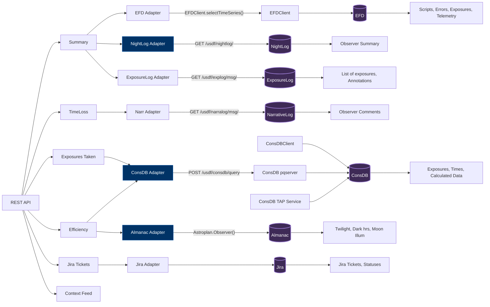

# Backend Data Flow Overview

We have a REST API calling services (almanac_service, consdb_service, jira_service, narrativelog_service). These services call the adapters and potentially combine or reformat the data as needed.

The blue adapters are what I understood as our priority: Nightlog (summary), ConsDB, Almanac, Jira.

Some data sources offer multiple options, but have 'preferred methods' of accessing their data (EFD, ConsDB). ConsDB will prefer the TAP service. EFD will prefer EFDClient.
_To do: move EFDClient to tssw, use ConsDB TAP Service instead of pqserver_

I tried to add our prioritized widgets/applets in the second level, so we could see where they need data from, and prioritize appropriately.

We do have a Jira Adapter now. (5/31/25)

On the very far right, I show what data we need from each source.

