# Backend Refactor Plan

## 1. General Overview

### Summary

This refactor introduces a consistent, Redis-backed caching architecture across all endpoints.
Caching is owned entirely by the adapter layer — each adapter is responsible for checking its
cache, fetching externally for any misses, storing results, and returning a complete
`dict[dayobs, data]` to the caller. The service layer becomes a thin collator: it calls its
adapter(s), merges the per-dayobs results, and returns. A middleware stack handles cross-cutting
concerns (validation, error formatting, cache-control headers) that are currently either duplicated
across endpoints or absent entirely.

### Key Decisions

**All caching lives in the adapter layer**
Redis (keyed by `(adapter, dayobs)`) is the only server-side cache in the system. The service
layer performs no caching. This keeps responsibilities cleanly separated: adapters own data
fetching and caching, services own collation.

Two further caching layers are enabled by `CacheControlMiddleware`:

- *Client*: `Cache-Control` response headers allow browsers to cache per-request results by URL,
  so repeated identical requests from the same user are served locally without hitting the server.
  - question - Is this something we have to set up/allow in our front end, or is this automatically in use by browsers? 
- *Nginx proxy cache*: the nginx reverse proxy in front of the application should be configured to
  honour and store responses with `Cache-Control` headers. This gives a shared cache across all
  users — historical responses can be cached at the proxy for as long as their `max-age` allows;
  today's responses are cached briefly (matching the `RefreshWorker` interval) so the proxy never
  serves data more stale than one refresh cycle.

**All adapters are `CachedAdapter` subclasses**
Rather than distinguishing between adapters that need caching and those that don't, all adapters
extend `CachedAdapter`. For adapters whose external calls are cheap, the TTL and cache overhead
is negligible; the consistency of the pattern is worth more than the optimisation of skipping it.

**Services are thin, singleton instances injected via `Depends()`**
Each `Service` subclass is instantiated once at startup with its adapters wired in. FastAPI's
`Depends()` injects the singleton into each endpoint. The service's `handle_request` calls
adapter(s), merges per-dayobs results, and returns via `collate_response`. No Redis interaction
occurs in the service layer.

**Dict of adapters per Service**
Each `Service` holds a `dict[str, CachedAdapter]`. In the common case this has one entry, but
multi-source endpoints (e.g. `/exposures`) can declare multiple adapters.

**Two separate Jira adapters for the two Jira endpoints**
`/jira-tickets` only needs OBS ticket data; `/block-details` needs OBS tickets with full BLOCK
details resolved. Rather than a single adapter that conditionally does the expensive second-phase
lookup, two adapters are used:

- `JiraObsCachedAdapter` — fetches and caches OBS tickets per dayobs only. Used by
  `JiraTicketsService`.
- `JiraObsBlockCachedAdapter` — fetches OBS tickets and resolves BLOCK details internally via
  `JiraBlockAdapter` and `ZephyrAdapter`, caching the fully resolved result per dayobs. Used by
  `BlockDetailsService`.

Both share OBS ticket fetching logic via a common private helper. The BLOCK detail resolution
(and its ID-keyed Redis cache) lives only in `JiraObsBlockCachedAdapter`. `JiraBlockAdapter` and
`ZephyrAdapter` are `IdBasedAdapter` subclasses — they expose `fetch_by_ids(ids)` and are called
adapter-to-adapter, not by the service.

**Background refresh on a dedicated daemon thread**
A `RefreshWorker` runs on its own daemon thread. On a configurable interval (default: 5 minutes)
it calls `refresh_today()` on each registered `CachedAdapter`. `refresh_today()` invalidates the
adapter's cache entry for today's dayobs and re-fetches, so the cache is always warm and user
requests for today never trigger an external fetch directly.

**Redis assumed always available**
If the server is running, Redis is available. No fallback path is implemented.

**Middleware for cross-cutting concerns**
Four middleware classes replace logic that is currently either scattered across endpoints or
missing:

1. `ErrorHandlingMiddleware` — catches all unhandled exceptions and returns structured JSON errors
2. `DayobsValidationMiddleware` — validates `dayobs` parameters, ensures `startDayObs <= endDayObs`
3. `CacheControlMiddleware` — adds `Cache-Control` headers; short max-age if the response includes
   today's dayobs, long max-age for fully historical responses
4. `PublicAccessMiddleware` — for the public-facing release, enforces `startDayObs == endDayObs`

**Specific `handle_request` signatures per subclass**
Each `Service` subclass defines its own typed `handle_request` signature. The base class does not
use `**kwargs`.

### Endpoints Outside the Pattern

| Endpoint | Reason |
|---|---|
| `/version`, `/health` | No data fetch; no caching needed |
| `/mock-exposures` | Reads a local file; no adapter |

These endpoints remain as simple FastAPI route functions with no `Service`.

### Pros

- Single cache layer is easier to reason about and debug
- Adapters are fully self-contained: fetch, cache, and return — no external orchestration needed
- Service layer is trivially simple and easy to test without Redis
- Consistent pattern across all adapters regardless of call cost
- Background refresh means today's data is always warm; no cold-cache penalty for users
- Cache-control headers enable downstream caching at the browser and nginx proxy levels
- Partial cache hits: a request for 7 days only fetches the days not already in the adapter cache
  - question - I'm not sure how this is true

### Cons

- Adapters carry more responsibility than a traditional adapter pattern — they own both fetching
  and caching
- `rubin_nights_service.py` (999 lines) still needs to be split into discrete adapters — the
  largest individual piece of work
- `JiraObsBlockCachedAdapter` internally orchestrates two further adapters, making it more complex
  than a typical adapter
- `/multi-night-visit-maps` generates a Bokeh visualisation across all nights jointly; per-dayobs
  caching still applies but `collate_response` must do the multi-night assembly, which is
  non-standard
- `/expected-exposures` returns a sum across the range rather than per-dayobs data; the adapter
  caches the per-dayobs count and `collate_response` sums them, which is a slight mismatch
  between the cache granularity and the response shape

---

## 2. New Class Overview

### `BaseAdapter` (ABC)

The abstract interface all dayobs-driven adapters implement.

```
BaseAdapter (ABC)
│
├── fetch(start_dayobs: int, end_dayobs: int) -> dict[int, Any]
│     Abstract. Returns data for the given dayobs range, partitioned by dayobs.
│     The returned data is in the format expected by the service layer (i.e. already
│     processed — no further transformation is needed after fetch() returns).
│
└── name: str
      Class-level identifier used as the key in Service.adapters dicts.
```

---

### `CachedAdapter` (ABC, extends `BaseAdapter`)

All adapters extend this class. The cache loop lives here; subclasses implement
`_fetch_from_source` and `_cache_key`.

```
CachedAdapter (ABC)
│
├── __init__(redis: Redis)
│
├── fetch(start_dayobs, end_dayobs) -> dict[int, Any]
│     Concrete. Implements the cache loop:
│       1. Enumerate all dayobs in [start_dayobs, end_dayobs].
│       2. For each dayobs, check Redis via _cache_key(dayobs).
│       3. Collect all cache misses.
│       4. If there are no misses, return cached data immediately — the upstream
│          source is never contacted and its status is irrelevant.
│       5. If there are any misses, call _fetch_from_source(missing_dayobs) as a
│          batch. Any upstream error propagates immediately and the entire request
│          fails — partial data is never returned.
    question - why not return partial data, why not say 'some days are available, only past 3 days available, not past 5'? 
│       6. Store each result via _store(dayobs, data).
│       7. Return the complete dict[int, Any] for the full range.
│
├── _fetch_from_source(dayobs_list: list[int]) -> dict[int, Any]
│     Abstract. Called with only the cache-missing dayobs. Performs the actual
│     external fetch and returns processed, frontend-ready data.
│
├── _cache_key(dayobs: int) -> str
│     Abstract. Returns a Redis key unique to this adapter and dayobs.
│     e.g. "adapter:ExposureEntries:20250101"
│
├── _store(dayobs: int, data: Any) -> None
│     Serialises data as JSON and writes to Redis with _ttl(dayobs). All adapter
│     implementations must return JSON-serialisable data from _fetch_from_source.
│
├── _ttl(dayobs: int) -> int
│     Short TTL (e.g. 5 minutes) if dayobs is today; long TTL (e.g. 30 days) otherwise.
│
└── refresh_today() -> None
      Invalidates the cache entry for today's dayobs and calls fetch(today, today) to
      repopulate it. Called by RefreshWorker. "Today" is computed as the current
      astronomical dayobs (rolls over at noon local time, not midnight).
```

question - what does 'concrete' vs 'abstract' mean for some of these functions? 
 
question - local time will always be prod deployment time right? what does 'noon local time' mean in `refresh_today`? 

---

### `IdBasedAdapter` (ABC)

For adapters whose data is keyed by an opaque ID rather than a dayobs. Used adapter-to-adapter
(currently only within `JiraObsBlockCachedAdapter`), not by the service layer.

```
IdBasedAdapter (ABC)
│
└── fetch_by_ids(ids: list[str]) -> dict[str, Any]
      Abstract. Fetches records for the given IDs and returns them keyed by ID.
      Implementations are responsible for batching and error handling.
```

`JiraBlockAdapter` and `ZephyrAdapter` are `IdBasedAdapter` subclasses. They are called only
from within `JiraObsBlockCachedAdapter` and maintain their own ID-keyed Redis cache (keyed e.g.
`block_detail:BLOCK-42`) with a long fixed TTL, using the same `_check_cache` / `_store` helpers
from `CachedAdapter` adapted for string keys.

question - why do we need a whole different adapter for this, can't `JiraObsBlockCachedAdapter`'s `fetch_from_source` just request by id from jira rather than needing a whole new adapter?

---

### `Service` (ABC)

A thin collator. Each subclass calls its adapter(s), merges results, and returns.

```
Service (ABC)
│
├── adapters: dict[str, CachedAdapter]
│     Injected at construction.
│
├── handle_request(...) -> dict
│     Abstract. Each subclass defines its own typed signature. 
question - what does that mean, its own signature ? 
|      Implementation:
│       1. Call each adapter's fetch(start_dayobs, end_dayobs).
│       2. Merge per-dayobs results across adapters into dict[int, dict[str, Any]].
│       3. Return collate_response(merged).
│
└── collate_response(data: dict[int, Any]) -> dict
      Concrete (overridable). Combines per-dayobs results into the final response
      payload. Default: returns a list sorted by dayobs under a "results" key.
      Visualisation services (e.g. VisitMapsService) override this to build
      multi-night figures from the per-night data.
```

answer - I think concrete vs abstract means 'implemented in abc' vs 'to be implemented in child' 

question - Returning a dict containing a list under a 'results' key seems pointless, can't we just return a list of the results? I think this is mimicing current patterns in the backend that I do not think are good patterns.

---

### `RefreshWorker`

Runs on a dedicated daemon thread. Holds references to all `CachedAdapter` singletons and
periodically calls `refresh_today()` on each.

question - is this thread a different microservice, or how does this run just one other thread? 
When we start up the backend we have 4 pods right now, so would we have 4 threads?
I think we would not.
Our startup.sh calls `run_logging_and_reporting.py` and that creates our uvicorn server.
We would want our `RefreshWorker` thread to be separate from each of those. 


```
RefreshWorker
│
├── __init__(adapters: list[CachedAdapter], interval_seconds: int = 300)
│
├── start() -> None
│     Starts the daemon thread. Called once at application startup.
│
├── stop() -> None
│     Signals the thread to stop cleanly. Called at application shutdown.
│
└── _run() -> None
      Loop: wait interval_seconds (interruptible), then call refresh_today() on each
      adapter. Logs failures per-adapter without aborting the loop. Updates its notion
      of "today" each iteration to handle dayobs rollovers.
```

---

### How They Work Together

```
Startup:
  redis = Redis(...)
  exposurelog_adapter = ExposurelogCachedAdapter(redis)
  exposure_entries_service = ExposureEntriesService(
      adapters={"exposurelog": exposurelog_adapter}
  )

  worker = RefreshWorker([exposurelog_adapter, ...], interval_seconds=300)
  worker.start()

question - is this on startup of our uvicorn server? 
question - why would we create the service before it's being called in an endpoint? 
answer? - for the RefreshWorker to call it? Why wouldn't we just have the RefreshWorker call the endpoints? 

Request: GET /exposure-entries?startDayObs=20250101&endDayObs=20250107&instrument=LSSTCam
  1. DayobsValidationMiddleware validates params
  2. FastAPI resolves Depends(get_exposure_entries_service) → exposure_entries_service
  3. Endpoint calls exposure_entries_service.handle_request(20250101, 20250107, "LSSTCam")
  4. handle_request calls exposurelog_adapter.fetch(20250101, 20250107)
  5. Inside fetch() cache loop:
       - 20250101–20250106: cache hits, returned immediately
       - 20250107: cache miss → _fetch_from_source([20250107]) called
       - Result stored in Redis with short TTL (today)
       - Returns {20250101: ..., ..., 20250107: ...}
  6. handle_request passes the full dict to collate_response and returns
  7. CacheControlMiddleware adds "Cache-Control: max-age=300" (today in range)

Request: GET /block-details?startDayObs=20250101&endDayObs=20250107
  1–3. Same middleware/Depends flow as above
  4. handle_request calls jira_obs_block_adapter.fetch(20250101, 20250107)
  5. Inside JiraObsBlockCachedAdapter._fetch_from_source([20250107]):
       a. Fetches OBS tickets from Jira for 20250107
       b. Extracts BLOCK IDs: ["BLOCK-42", "BLOCK-99"]
       c. Checks ID-keyed Redis: "block_detail:BLOCK-42" → hit
                                  "block_detail:BLOCK-99" → miss
       d. Calls jira_block_adapter.fetch_by_ids(["BLOCK-99"])
          and zephyr_adapter.fetch_by_ids(["BLOCK-99"])
       e. Stores "block_detail:BLOCK-99" with long fixed TTL
       f. Returns fully resolved data for 20250107
  6. _resolve_dayobs_range stores result, returns complete dict
  7. handle_request collates and returns

Background (every 5 minutes):
  worker calls exposurelog_adapter.refresh_today()
  → invalidates today's cache entry
  → calls fetch(today, today) to repopulate
```

---

## 3. Infrastructure Notes

question - what happens to the cache every time we update or re-deploy the application? 
question - what if a user/robert thinks the BLOCK definition has changed since the cache has stored the existing definition? Can someone refresh the cached definitions? Will those BLOCK definitions change? 

### Redis Configuration

Redis must be configured as a cache, not a general-purpose data store. Recommended settings:

```
maxmemory <N>mb              # set based on available RAM, leave headroom for the OS
maxmemory-policy allkeys-lru # evict least-recently-used keys when memory limit is hit
save ""                      # disable RDB snapshots — this is a cache, not a database
```

`allkeys-lru` means Redis will automatically evict the least-recently-used entries (regardless
of TTL) when memory pressure occurs. Historical dayobs entries that haven't been requested in a
long time are naturally evicted first, while frequently-accessed data is retained.

Persistence (`save`, `appendonly`) should be disabled — if Redis restarts, the adapters simply
repopulate the cache on next request. Persistence adds I/O overhead with no benefit for a cache.

A single shared connection pool should be instantiated once at application startup and passed to
all adapters. This avoids each adapter opening its own connections and ensures the total number
of connections to Redis stays bounded.

question - did we say this shared connection would be a `Depends()`?

### Metrics and Instrumentation

By centralising all caching and external fetching in `CachedAdapter`, the new architecture makes
it straightforward to instrument the system consistently. Cache hit rates, upstream fetch
durations, and error rates per adapter could all be tracked from a single point in the base
class, without any per-adapter instrumentation code. This would extend naturally to tools such
as Prometheus and Grafana if desired.

---

## 4. Open Questions

### Sync vs Async

**Decision: adapters will be synchronous.**

The codebase's dependencies (rubin_sim, rubin_scheduler, schedview, astroplan, astropy, requests)
are all synchronous scientific Python libraries that cannot be made async. Even with async
adapters, all computation involving these libraries would require `run_in_executor` wrapping —
async syntax over fundamentally synchronous work. The `RefreshWorker` thread would also require
careful event loop management that sync adapters avoid entirely. FastAPI endpoint handlers will
call sync adapter methods via `run_in_threadpool` where needed, consistent with the existing
pattern in the codebase.

---

### Authentication

> **This is unresolved and needs input before implementation begins.**

The current code passes the user's RSP token through to upstream API calls (exposurelog,
narrativelog, Jira, etc.). With singleton adapters and a shared cache this is problematic: the
cache is keyed by `(adapter, dayobs)`, not by user, so whoever triggers a cache miss donates
their token to populate an entry shared by all users.

Answer - Frossie already mentioned that we should have per-deployment service accounts for nightly digest so we can track the usage load it puts on any of the databases.

The resolution depends on whether upstream APIs support service account tokens:

**Option A — Service-level credentials (preferred)**
Each adapter is configured at startup with a service account token (from a k8s secret or env
var) for its upstream API. No token is passed at request time. The RSP gateway (internal) or
nginx/ingress (public) handles user authentication before requests reach this application. The
public deployment works identically — same service account model, different auth enforcement
point.

This fits cleanly with the singleton adapter model and requires no changes to adapter method
signatures.

**Option B — Per-request token pass-through (fallback)**
If upstream APIs require per-user RSP tokens, the token must be threaded through the call chain:
`handle_request(..., token=token)` → `adapter.fetch(..., token=token)` →
`_fetch_from_source(dayobs_list, token=token)`. The adapter uses whichever token triggered a
cache miss for the external call; subsequent requests for the same dayobs are served from cache
with no token needed.

This works but complicates adapter signatures and means the user who triggers a cold cache miss
is the one whose token is used for the upstream fetch.

**Action required**: confirm with the RSP/services team whether upstream APIs support service
account tokens, or require per-user tokens.

---

## 5. Implementation Changes

### Step 0: Cache-Control Middleware and Nginx Proxy Cache

This step is independent of the main refactor and should be completed first. It delivers
immediate caching benefits at the HTTP layer without touching the adapter or service code.

**What to do:**

1. Add `CacheControlMiddleware` to `web_app/main.py`. The middleware inspects the `dayObs`,
   `startDayObs`, and `endDayObs` query parameters on each response and sets `Cache-Control:
   max-age=<N>` accordingly — a short value (e.g. 300 seconds, matching the intended
   `RefreshWorker` interval) if today's dayobs is in the requested range, a long value (e.g.
   86400 seconds) for fully historical requests.

2. Configure the nginx reverse proxy to cache responses that carry a `Cache-Control` header with
   a positive `max-age`. Key directives: `proxy_cache_path`, `proxy_cache_valid`, and
   `proxy_cache_use_stale`. The cache should be keyed on the full request URL so that different
   dayobs ranges are cached independently.

**Why first:**

- Entirely additive — no existing code is changed beyond registering one middleware
- Immediately reduces load on the backend for repeated identical requests
- Establishes the caching contract (short TTL for today, long TTL for history) that the rest of
  the refactor is built around


question - does step 0 end here? 

---

### New Files

| File | Description |
|---|---|
| `web_app/middleware/__init__.py` | Exports all middleware classes |
| `web_app/middleware/cache_control.py` | `CacheControlMiddleware` — sets `Cache-Control` headers based on whether today's dayobs is in the requested range |
| `web_app/middleware/error_handling.py` | `ErrorHandlingMiddleware` — catches unhandled exceptions and returns structured JSON using the existing `BaseLogrepError` hierarchy from `exceptions.py` |
| `web_app/middleware/dayobs_validation.py` | `DayobsValidationMiddleware` — validates dayobs query params and enforces `startDayObs <= endDayObs` |
| `web_app/middleware/public_access.py` | `PublicAccessMiddleware` — enforces `startDayObs == endDayObs`; disabled in the internal deployment |
| `web_app/base_adapter.py` | `BaseAdapter` ABC, `CachedAdapter` ABC, `IdBasedAdapter` ABC |
| `web_app/service.py` | `Service` ABC and `RefreshWorker` |
| `adapters/http.py` | Shared HTTP helpers (`protected_get`, `protected_post`) extracted from `source_adapters.py` |
| `adapters/exposurelog.py` | `ExposurelogCachedAdapter` (moved from `source_adapters.py`) |
| `adapters/narrativelog.py` | `NarrativelogCachedAdapter` (moved from `source_adapters.py`) |
| `adapters/nightreport.py` | `NightReportCachedAdapter` (moved from `source_adapters.py`) |
| `adapters/consdb.py` | `ConsdbCachedAdapter` (moved from `consdb.py`) |
| `adapters/almanac.py` | `AlmanacCachedAdapter` (moved from `almanac.py`) |
| `adapters/jira.py` | `JiraObsCachedAdapter` (OBS tickets only), `JiraObsBlockCachedAdapter` (OBS + BLOCK details), `JiraBlockAdapter` (moved from `jira.py`) |
| `adapters/zephyr.py` | `ZephyrAdapter` (moved from `zephyr_service.py`) |
| `adapters/rubin_nights_dome.py` | `RubinNightsDomeAdapter` (split from `rubin_nights_service.py`) |
| `adapters/rubin_nights_efd.py` | `RubinNightsEFDAdapter` (split from `rubin_nights_service.py`) |
| `adapters/rubin_nights_context.py` | `RubinNightsContextAdapter` (split from `rubin_nights_service.py`) |
| `adapters/rubin_nights_visits.py` | `RubinNightsVisitsAdapter` (split from `rubin_nights_service.py`) |
| `adapters/expected_exposures.py` | `ExpectedExposuresCachedAdapter` (split from `scheduler_service.py`) |
| `adapters/survey_progress.py` | `SurveyProgressCachedAdapter` (split from `scheduler_service.py`) |
| `adapters/__init__.py` | Exports all adapter classes |
| `web_app/services/obs_status_service.py` | `ObsStatusService` (split from `rubin_nights_service.py`) |
| `web_app/services/context_feed_service.py` | `ContextFeedService` (split from `rubin_nights_service.py`) |
| `web_app/services/visit_maps_service.py` | `VisitMapsService` (split from `rubin_nights_service.py`) |

### Modified Files

**`docker-compose.yml`** (frontend repo)

- Add a `redis` service with the recommended configuration (`maxmemory`, `maxmemory-policy allkeys-lru`, persistence disabled)

**`nginx.conf`** (frontend repo)

- Add proxy cache configuration (`proxy_cache_path`, `proxy_cache_valid`, `proxy_cache_use_stale`) so the nginx proxy caches responses that carry a positive `Cache-Control: max-age` header

**`source_adapters.py`** → **deleted**

- `NightReportAdapter`, `NarrativelogAdapter`, and `ExposurelogAdapter` each move to their own
  file (see new files below)
- `SourceAdapter` ABC is removed entirely (replaced by `BaseAdapter` / `CachedAdapter`)
- HTTP helpers (`protected_get`, `protected_post`) move to a shared `adapters/http.py` utility

**`consdb.py`** → **deleted**, moved to `adapters/consdb.py`

- `ConsdbCachedAdapter` extends `CachedAdapter`; implements `_fetch_from_source(dayobs_list)`
  and `_cache_key(dayobs)`; retains `query()` as an internal helper

**`almanac.py`** → **deleted**, moved to `adapters/almanac.py`

- `AlmanacCachedAdapter` extends `CachedAdapter`; `_fetch_from_source` internally iterates over
  the dayobs list and computes almanac data per dayobs using `astroplan`

**`jira.py`** → **deleted**, moved to `adapters/jira.py`

- Split into three classes:
  - `JiraObsCachedAdapter(CachedAdapter)` — `_fetch_from_source` fetches and caches OBS tickets
    per dayobs only; used by `JiraTicketsService`
  - `JiraObsBlockCachedAdapter(CachedAdapter)` — fetches OBS tickets (via shared private helper)
    then resolves BLOCK details via `JiraBlockAdapter` and `ZephyrAdapter`; caches the fully
    resolved result per dayobs; used by `BlockDetailsService`
  - `JiraBlockAdapter(IdBasedAdapter)` — implements `fetch_by_ids(ids)` wrapping
    `fetch_block_ticket_summaries()`; called only by `JiraObsBlockCachedAdapter`

**`web_app/main.py`**

- Register all four middleware classes (error handling first, then public access, then dayobs
  validation, then cache control)
- Replace each data endpoint body with a single `Depends()`-injected service call
- Add `startup` and `shutdown` event handlers to start/stop `RefreshWorker`
- Add module-level singleton instantiation of all `Service` subclasses, their adapters, and the
  `RefreshWorker`
- Endpoints without a `Service` (`/version`, `/health`, `/mock-exposures`) remain as simple
  route functions

**`web_app/services/exposurelog_service.py`**

- Replace `get_exposure_flags()` and `get_exposurelog_entries()` with
  `ExposureFlagsService(Service)` and `ExposureEntriesService(Service)`, both using a shared
  `ExposurelogCachedAdapter` instance

**`web_app/services/consdb_service.py`**

- Replace `get_exposures()` and `get_data_log()` with `ExposuresService(Service)` and
  `DataLogService(Service)`
- `ExposuresService` holds `{"consdb": ConsdbCachedAdapter, "dome": RubinNightsDomeAdapter}`
- `get_mock_exposures()` remains as a plain function

**`web_app/services/almanac_service.py`**

- Replace `get_almanac()` with `AlmanacService(Service)` using `AlmanacCachedAdapter`

**`web_app/services/narrativelog_service.py`**

- Replace `get_messages()` with `NarrativeLogService(Service)` using
  `NarrativelogCachedAdapter`

**`web_app/services/nightreport_service.py`**

- Replace `get_night_reports()` with `NightReportService(Service)` using
  `NightReportCachedAdapter`

**`web_app/services/jira_service.py`**

- Replace `get_jira_tickets()` with `JiraTicketsService(Service)` using `JiraObsCachedAdapter`
- Replace block-details logic with `BlockDetailsService(Service)` using
  `JiraObsBlockCachedAdapter`
- Retain filter helpers (`filter_tickets_with_instrument_match` etc.) as module-level utilities

**`web_app/services/zephyr_service.py`**

- Convert `ZephyrInterface` wrapper into `ZephyrAdapter(IdBasedAdapter)` implementing
  `fetch_by_ids(ids)`
- No `Service` subclass needed; `ZephyrAdapter` is held by `JiraObsBlockCachedAdapter`

**`web_app/services/rubin_nights_service.py`** → **deleted**, replaced by:

- Adapter classes move to `adapters/rubin_nights_*.py` (see new files above):
  - `RubinNightsDomeAdapter(CachedAdapter)` — dome open/close times
  - `RubinNightsEFDAdapter(CachedAdapter)` — observatory status events
  - `RubinNightsContextAdapter(CachedAdapter)` — context feed messages
  - `RubinNightsVisitsAdapter(CachedAdapter)` — visit data
- Service classes move to three new files:
  - `web_app/services/obs_status_service.py` — `ObsStatusService(Service)` using
    `RubinNightsEFDAdapter`
  - `web_app/services/context_feed_service.py` — `ContextFeedService(Service)` using
    `RubinNightsContextAdapter`
  - `web_app/services/visit_maps_service.py` — `VisitMapsService(Service)` using
    `RubinNightsVisitsAdapter`; overrides `collate_response` to build the multi-night Bokeh
    figure from per-night visit data

**`web_app/services/scheduler_service.py`**

- Replace `get_expected_exposures()` with `ExpectedExposuresService(Service)` using
  `ExpectedExposuresCachedAdapter`. The adapter caches the per-dayobs `nominal_visits` count from
  `fetch_sim_stats_for_night()`; `collate_response` sums counts across the range and returns
  `{"sum_exposures": N}`
- Add `SurveyProgressService(Service)` using `SurveyProgressCachedAdapter`. The adapter caches
  the Bokeh figure JSON per dayobs — particularly valuable given the heavy `rubin_sim` /
  `ModelObservatory` computation involved
- `build_visit_maps_using_builder()` logic moves into `VisitMapsService.collate_response()`,
  which receives per-night visit data from `RubinNightsVisitsAdapter` and builds the Bokeh figure
- Visualisation helpers remain in the file, called from within the service

### Deleted Files / Removed Code

| Item | Reason |
|---|---|
| `source_adapters.py` | Split into `adapters/exposurelog.py`, `adapters/narrativelog.py`, `adapters/nightreport.py`; `SourceAdapter` ABC replaced by `BaseAdapter` / `CachedAdapter` |
| `consdb.py` | Moved to `adapters/consdb.py` |
| `almanac.py` | Moved to `adapters/almanac.py` |
| `jira.py` | Moved to `adapters/jira.py` |
| Standalone service functions in each `services/*.py` | Replaced by `Service` subclasses |

---

### Implementation Order

After Step 0 (cache-control middleware + nginx), the main refactor should proceed in this order
to validate the pattern on simpler cases before tackling the riskiest parts:

1. **`base_adapter.py` and `service.py` ABCs** — lay the foundation everything else builds on
2. **Simple REST adapters** — `ExposurelogCachedAdapter`, `NarrativelogCachedAdapter`,
   `NightReportCachedAdapter`, `AlmanacCachedAdapter`, `JiraObsCachedAdapter` — well-understood,
   fast to implement, validate the caching pattern end-to-end
3. **Service layer refactor** — once adapters exist the services are thin and quick; do all of
   them together
4. **`JiraObsBlockCachedAdapter`** — builds on `JiraObsCachedAdapter` but adds the two-phase
   block detail resolution; tackle after the service layer is in place
5. **ConsDB adapter** — SQL-based, more complex than the REST adapters but self-contained
6. **Scheduler adapters** — `ExpectedExposuresCachedAdapter`, `SurveyProgressCachedAdapter`
7. **`rubin_nights` split** — largest and riskiest; leave last so the pattern is well-established
   before touching the most complex code

### Testing

The new architecture is significantly more testable than the current one. Adapters can be tested
in isolation by mocking Redis and the external API; services can be tested by mocking adapters;
middleware can be tested independently of the rest of the application.

However, the existing test suite was written against the current architecture and will need
substantial rework — existing tests that call service functions directly will no longer apply.
New tests should be written alongside each adapter as it is implemented (step 2 above), rather
than deferred to the end. The testing patterns established for the first few adapters will serve
as templates for the rest.

---

## 6. Architecture Diagram

```plantuml
@startuml new_architecture

skinparam componentStyle rectangle
skinparam linetype ortho
skinparam packageStyle rectangle

actor Client

package "Middleware Stack" {
    component [ErrorHandlingMiddleware] as MW_ERR
    component [PublicAccessMiddleware] as MW_PUB
    component [DayobsValidationMiddleware] as MW_DAY
    component [CacheControlMiddleware] as MW_CC
}

package "Endpoints (main.py)" {
    component [/exposure-entries] as EP1
    component [/exposure-flags] as EP2
    component [/exposures] as EP3
    component [/data-log] as EP6
    component [/jira-tickets] as EP7
    component [/block-details] as EP8
    component [/almanac] as EP9
    component [/narrative-log] as EP10
    component [/night-reports] as EP11
    component [/obs-status] as EP12
    component [/context-feed] as EP13
    component [/multi-night-visit-maps] as EP14
    component [/expected-exposures] as EP15
    component [/survey-progress-map] as EP16
    component [/version\n/health\n/mock-exposures] as EP_SIMPLE
}

package "Service Layer (web_app/services/)" {
    component [ExposureEntriesService] as SVC1
    component [ExposureFlagsService] as SVC2
    component [ExposuresService] as SVC3
    component [DataLogService] as SVC6
    component [JiraTicketsService] as SVC7
    component [BlockDetailsService] as SVC8
    component [AlmanacService] as SVC9
    component [NarrativeLogService] as SVC10
    component [NightReportService] as SVC11
    component [ObsStatusService] as SVC12
    component [ContextFeedService] as SVC13
    component [VisitMapsService] as SVC14
    component [ExpectedExposuresService] as SVC15
    component [SurveyProgressService] as SVC16
}

database "Redis" as REDIS {
    component [Adapter Cache\n(keyed by adapter + dayobs)] as REDIS_ADP
    component [Block Detail Cache\n(keyed by ticket ID)] as REDIS_BLK
}

package "Adapter Layer" {
    package "adapters/" {
        component [ExposurelogCachedAdapter] as AD_EXP
        component [NarrativelogCachedAdapter] as AD_NAR
        component [NightReportCachedAdapter] as AD_NIG
        component [ConsdbCachedAdapter] as AD_CDB
        component [AlmanacCachedAdapter] as AD_ALM
        component [ExpectedExposuresCachedAdapter] as AD_EXP_EXP
        component [SurveyProgressCachedAdapter] as AD_SURV
    }
    package "adapters/jira.py" {
        component [JiraObsCachedAdapter] as AD_JIRA_OBS
        component [JiraObsBlockCachedAdapter] as AD_JIRA_OBS_BLK
        component [JiraBlockAdapter\n<<IdBasedAdapter>>] as AD_JIRA_BLK
    }
    package "adapters/zephyr.py" {
        component [ZephyrAdapter\n<<IdBasedAdapter>>] as AD_ZEP
    }
    package "adapters/rubin_nights_*.py" {
        component [RubinNightsDomeAdapter] as AD_DOME
        component [RubinNightsEFDAdapter] as AD_EFD
        component [RubinNightsContextAdapter] as AD_CTX
        component [RubinNightsVisitsAdapter] as AD_VIS
    }
}

package "External Data Sources" {
    component [Exposurelog API] as EXT_EXP
    component [Narrativelog API] as EXT_NAR
    component [Night Report API] as EXT_NIG
    component [ConsDB] as EXT_CDB
    component [Jira] as EXT_JIRA
    component [Zephyr] as EXT_ZEP
    component [EFD] as EXT_EFD
    component [rubin_nights / schedview] as EXT_RN
    component [rubin_sim] as EXT_SIM
}

component [RefreshWorker\n(daemon thread)] as WORKER

' Request flow through middleware
Client --> MW_ERR
MW_ERR --> MW_PUB
MW_PUB --> MW_DAY
MW_DAY --> MW_CC
MW_CC --> EP1
MW_CC --> EP2
MW_CC --> EP3
MW_CC --> EP6
MW_CC --> EP7
MW_CC --> EP8
MW_CC --> EP9
MW_CC --> EP10
MW_CC --> EP11
MW_CC --> EP12
MW_CC --> EP13
MW_CC --> EP14
MW_CC --> EP15
MW_CC --> EP16
MW_CC --> EP_SIMPLE

' Endpoints to services (via Depends)
EP1 --> SVC1
EP2 --> SVC2
EP3 --> SVC3
EP6 --> SVC6
EP7 --> SVC7
EP8 --> SVC8
EP9 --> SVC9
EP10 --> SVC10
EP11 --> SVC11
EP12 --> SVC12
EP13 --> SVC13
EP14 --> SVC14
EP15 --> SVC15
EP16 --> SVC16

' Services to adapters
SVC1 --> AD_EXP
SVC2 --> AD_EXP
SVC3 --> AD_CDB
SVC3 --> AD_DOME
SVC6 --> AD_CDB
SVC7 --> AD_JIRA_OBS
SVC8 --> AD_JIRA_OBS_BLK
SVC9 --> AD_ALM
SVC10 --> AD_NAR
SVC11 --> AD_NIG
SVC12 --> AD_EFD
SVC13 --> AD_CTX
SVC14 --> AD_VIS
SVC15 --> AD_EXP_EXP
SVC16 --> AD_SURV

' All CachedAdapters interact with adapter cache
AD_EXP <--> REDIS_ADP
AD_NAR <--> REDIS_ADP
AD_NIG <--> REDIS_ADP
AD_CDB <--> REDIS_ADP
AD_ALM <--> REDIS_ADP
AD_JIRA_OBS <--> REDIS_ADP
AD_JIRA_OBS_BLK <--> REDIS_ADP
AD_DOME <--> REDIS_ADP
AD_EFD <--> REDIS_ADP
AD_CTX <--> REDIS_ADP
AD_VIS <--> REDIS_ADP
AD_EXP_EXP <--> REDIS_ADP
AD_SURV <--> REDIS_ADP

' JiraObsBlockCachedAdapter internally uses ID-based adapters and block cache
AD_JIRA_OBS_BLK <--> REDIS_BLK
AD_JIRA_OBS_BLK --> AD_JIRA_BLK : fetch_by_ids\n(on block cache miss)
AD_JIRA_OBS_BLK --> AD_ZEP : fetch_by_ids\n(on block cache miss)

' Adapters to external sources (on adapter cache miss)
AD_EXP --> EXT_EXP
AD_NAR --> EXT_NAR
AD_NIG --> EXT_NIG
AD_CDB --> EXT_CDB
AD_ALM --> EXT_RN
AD_JIRA_OBS --> EXT_JIRA
AD_JIRA_OBS_BLK --> EXT_JIRA
AD_JIRA_BLK --> EXT_JIRA
AD_ZEP --> EXT_ZEP
AD_DOME --> EXT_EFD
AD_EFD --> EXT_EFD
AD_CTX --> EXT_EFD
AD_VIS --> EXT_RN
AD_EXP_EXP --> EXT_SIM
AD_SURV --> EXT_SIM

' Background worker refreshes all CachedAdapters
WORKER --> AD_EXP
WORKER --> AD_NAR
WORKER --> AD_NIG
WORKER --> AD_CDB
WORKER --> AD_ALM
WORKER --> AD_JIRA_OBS
WORKER --> AD_JIRA_OBS_BLK
WORKER --> AD_DOME
WORKER --> AD_EFD
WORKER --> AD_CTX
WORKER --> AD_VIS
WORKER --> AD_EXP_EXP
WORKER --> AD_SURV

@enduml
```


